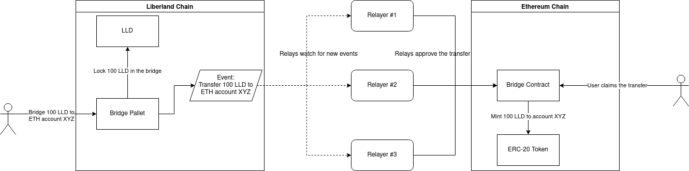
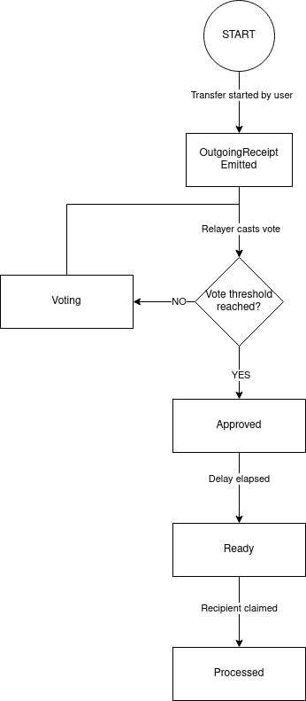

## Summary

The Liberland to Ethereum Bridge is a secure interface that facilitates the transfer of Liberland Dollars (LLD) and Liberland Merits (LLM) between the Liberland and Ethereum blockchains. This system relies on the integrity of relayers for its operations.

The bridge comprises three main components:
- [Bridge Pallet](https://github.com/liberland/liberland_substrate/tree/develop/frame/federated-bridge) on the Liberland Blockchain
- [Bridge Contract](https://github.com/liberland/liberland_substrate/tree/develop/eth-bridge/contracts) on the Ethereum Blockchain
- [Bridge Relayer](https://github.com/liberland/bridge_relay), an off-chain entity responsible for passing messages between the two chains

## Terminology

For a comprehensive understanding, the following terms are defined:
- **Bridge**: The complete system enabling the transfer of LLD and LLM, inclusive of the bridge pallet, relays, watchers, and bridge contract.
- **Bridge Pallet**: A component on the Liberland chain, responsible for asset locking and unlocking.
- **Bridge Contract**: Deployed on the Ethereum blockchain, this contract is responsible for asset minting and burning.
- **Mint/Burn**: The process of creating or destroying wrapped tokens on Ethereum.
- **Lock/Unlock**: The mechanism for securing assets on the Liberland side while they are represented as wrapped tokens on the Ethereum side.
- **Stop**: A state that halts all bridge activities.
- **Relayer**: Off-chain software that oversees bridge transfers and relays information between the chains.
- **Watcher**: Off-chain software monitoring the behavior of relays.

## High-Level Architecture

Relayers observe `OutgoingReceipts` on the source chain and vote to approve these transfers on the destination chain, termed as `IncomingReceipts`. Once a predetermined number of votes are obtained, assets can be claimed on the destination chain.

For transfers from Liberland to Ethereum:
- Assets are secured in the bridge pallet.
- ERC-20 tokens are minted by the bridge contract.

For transfers from Ethereum to Liberland:
- ERC-20 tokens are destroyed by the bridge contract.
- Assets are released from the bridge pallet.

## Design Considerations

Core design principles include:
- Limiting the bridge's functionality to LLD and LLM transfers to minimize attack vectors.
- Prioritizing asset security and data integrity over system availability.
- Favoring on-chain voting for consensus among relayers over off-chain multisig solutions.

## Roles and Responsibilities

Various roles with specific permissions exist within the system:

| Role                        | Description                                           | Permissions                                                                   |
| --------------------------- | ----------------------------------------------------- | ----------------------------------------------------------------------------- |
| Liberland Blockchain Root   | Can modify the system code, thus affecting the bridge | Code upgrades, admin and super admin changes                                  |
| Ethereum Contracts Upgrader | Can modify Ethereum bridge contracts                  | Ethereum contract upgrades                                                    |
| Super Admin | Role that can do administrative operations that - if used maliciously - could result in unauthorized transfer of funds | Add relays, remove watchers, change admin and superadmin, change number of required votes + has all rights of Admin |
| Admin | Role that can do administrative operations that - if used maliciously - could result in stopping the bridge, but not transfer funds | Remove relays, add watchers, stop and resume bridge, set fees, change admin. |
| Relayer                     | Facilitates inter-chain messages                      | Voting for transfer approvals                                                 |
| Watcher                     | Monitors bridge operations                            | Ability to halt bridge activities                                             |

## Security Features

Implemented features aimed to mitigate risks include:
- Bridge halting if discrepancies in transfer details between relayers are detected.
- Anytime stoppage of the bridge by a watcher.
- Rate-limiting for asset minting and unlocking.
- Minimum transfer amount requirements.
- Limitations on wrapped tokens and locked assets.
- Delays for claims, providing watchers time to act.
- Restrictions against minting or burning native Liberland tokens.

## Risk Assessment and Mitigations

| Risk                                                    | Potential Impact             | Mitigation Strategies                      |
| ------------------------------------------------------- | ---------------------------- | ------------------------------------------ |
| Malicious or compromised Super Admin, Root, or Upgrader | Unauthorized asset transfers | Use of multisig accounts                   |
| Malicious or comprised Majority of Relayers and all Watchers | Unauthorized asset transfers | Independent and multiple operators    |
| Critical software vulnerabilities                       | Unauthorized asset transfers | Layered security and comprehensive testing |
| Malicious or compromised Admin                          | Bridge stoppage              | Use of multisig accounts                   |
| Major software vulnerabilities                          | Bridge stoppage              | Comprehensive testing                      |
| Malicious or compromised Watcher                        | Bridge stoppage              | None                                       |

## State Transitions of a Transfer

A transfer undergoes the following states:
- Initiation through either a `burn` on the bridge contract or a `deposit` on the bridge pallet.
- `OutgoingReceipt` emitted on the source chain.
- `Voting` state until required relayer votes are obtained.
- `Approved` state initiates a countdown.
- `Ready` state allows the user to claim their assets after countdown is done.
- Transfer concludes at the `Processed` state.