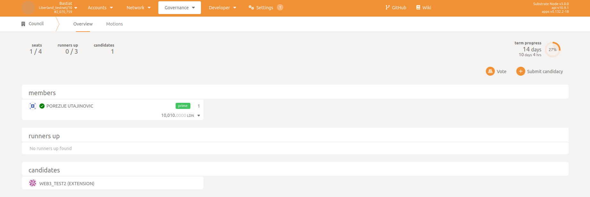
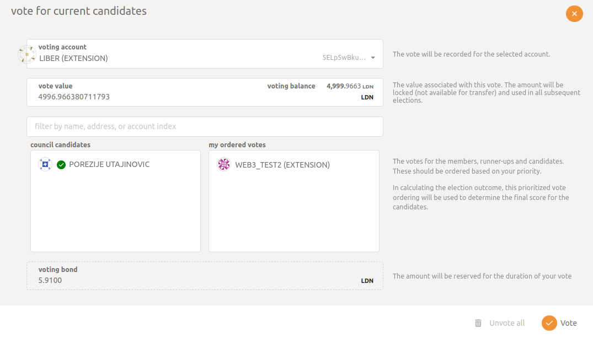
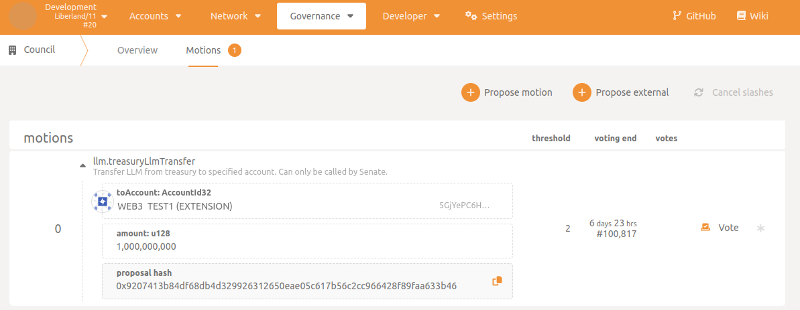
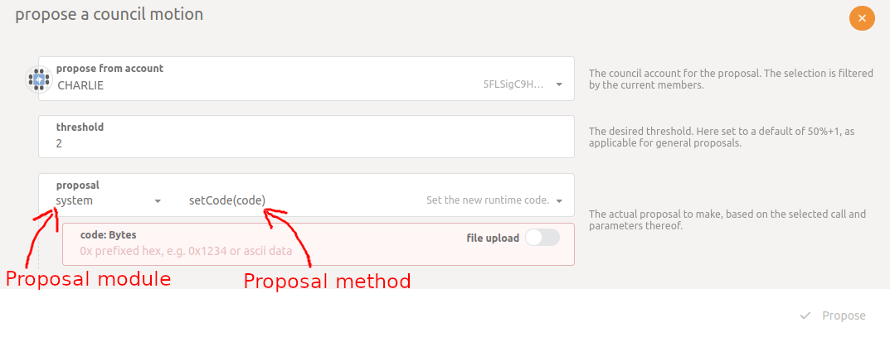

# Congress

Here you will find all the necessary information about the Liberland Congress. [Learn more about our congress](https://liberland-1.gitbook.io/wiki/v/public-documents/primers/congress).

Congressmen have some passive options. One such possibility is for citizens to receive their delegated votes.

## Congress view

Below is a screenshot showing the [congress of Liberland](https://polkadot.js.org/apps/?rpc=wss%3A%2F%2Fmainnet.liberland.org#/council). It is widely available and each citizen can display the number of congressmen, candidates and also submit candidacy.

 

 

### Voting for Congressman

Every citizen can vote to elect a congressman. Voting for congressmen takes place on [Phragmen's voting rules](https://en.wikipedia.org/wiki/Phragmen%27s_voting_rules). This means that a citizen can vote for many candidates, but the power of a vote is smaller with each subsequent candidate. So the first vote has the highest weight

1. Visit [Polkadot.js Apps](https://polkadot.js.org/apps/?rpc=wss%3A%2F%2Fmainnet.liberland.org#/council)
2. Click "Vote"
3. Select a candidate from the list and then click on the "Vote" button

In the voting panel, you can choose many candidates for whom you want to vote. The order of votes in the panel also matters - the higher the person is, the more important the vote they will receive.

 

 

### Application for congressman

Any citizen can apply to be a congressman.

#### Requirements

- Liberland citizenship
- [identity](https://liberland-1.gitbook.io/wiki/v/public-documents/blockchain/for-citizens/identity)

#### How to apply

1. Visit [Polkadot.js Apps](https://polkadot.js.org/apps/?rpc=wss%3A%2F%2Fmainnet.liberland.org#/council)
2. Click "Submit candidacy"
3. Select the account you want to apply with then click "Sign and Submit"

 

 

After applying, other citizens can vote for you and other candidates.

### Congressmen's actions

Congressmen can submit proposals under the ["Motions" tab](https://polkadot.js.org/apps/?rpc=wss%3A%2F%2Ftestchain.liberland.org%2F#/council/motions). Then these proposals can be considered by the whole Congress.

If you do not know what proposals you can make, find out more here.

#### How to vote for a proposal

All pending proposals are displayed in the ["Motions" tab](https://polkadot.js.org/apps/?rpc=wss%3A%2F%2Ftestchain.liberland.org%2F#/council/motions). Proposals are displayed as a list and any congressman can vote on them.

As you can see, next to the motion there is a vote button. It opens the voting panel. Then on the panel, you can vote for or against the proposal

 

 

#### How to submit proposals

To vote, you need to set the correct threshold and proposal. Different actions may require different minimum thresholds. Threshold is the minimum percentage of votes that a proposal must receive in order to be approved.

1. Open the ["Motions" tab](https://polkadot.js.org/apps/?rpc=wss%3A%2F%2Ftestchain.liberland.org%2F#/council/motions)
2. Click the "Propose motion" button
3. Fill in the information about the proposal and then click the "Propose" button

 

 

### Liberland legislation

Congressmen are able to add and remove rights at the international treaty tier. The international treaty tier is represented as "tier=1". Learn more about these methods in `Thresholds`

### Thresholds

What is thresholds. This is a number or percentage of votes representing the number of congressmen who must vote for a proposal created in order for it to be accepted.

The screenshots presented below contain a description of the fields that will allow us to better understand the table.
 

 
Different actions in Congress require different votes to approve the vote. Below is a table of possible actions with minimum threshold values.

| Proposal module            | Proposal method            | min thresholds percent | Additional requirements | description                                                                                                                                                                                                                                                                                                                                              |
| -------------------------- | -------------------------- | ---------------------- | ----------------------- | -------------------------------------------------------------------------------------------------------------------------------------------------------------------------------------------------------------------------------------------------------------------------------------------------------------------------------------------------------- |
| staking                    | setMinCommission           | 75%                    |                         | Sets the minimum amount of commission that each validators must maintain.                                                                                                                                                                                                                                                                                |
| democracy                  | externalPropose            | 50%                    |                         | Schedule a referendum to be tabled once it is legal to schedule an external referendum.                                                                                                                                                                                                                                                                  |
|                            | externalProposeMajority    | 75%                    |                         | Schedule a majority-carries referendum to be tabled next once it is legal to schedule an external referendum.                                                                                                                                                                                                                                            |
|                            | externalProposeDefault     | 100%                   |                         | Schedules a proposal to become a negative-turnout-bias referendum once it is legal for an externally proposed referendum.                                                                                                                                                                                                                                |
|                            | emergencyCancel            | 66%                    |                         | Schedule an emergency cancellation of a referendum. Cannot happen twice to the same referendum.                                                                                                                                                                                                                                                          |
| technicalMembership        | addMember                  | More than 50%          |                         | Add a member `who` to the membership. This module for managing Technical Collective membership.                                                                                                                                                                                                                                                          |
|                            | removeMember               | More than 50%          |                         | Remove a member `who` from the membership.                                                                                                                                                                                                                                                                                                               |
|                            | swapMember                 | More than 50%          |                         | Swap out one member `remove` for another `add`.                                                                                                                                                                                                                                                                                                          |
|                            | resetMembers               | More than 50%          |                         | Replace all memberships with new one.                                                                                                                                                                                                                                                                                                                    |
|                            | setPrime                   | More than 50%          |                         | Set the prime member. Must be a current member.                                                                                                                                                                                                                                                                                                          |
|                            | clearPrime                 | More than 50%          |                         | Remove the prime member if it exists.                                                                                                                                                                                                                                                                                                                    |
| treasury                   | approveProposal            | 60%                    |                         | Approve a proposal.                                                                                                                                                                                                                                                                                                                                      |
|                            | rejectProposal             | More than 50%          |                         | Reject a proposed spend. The original deposit will be slashed.                                                                                                                                                                                                                                                                                           |
|                            | removeApproval             | More than 50%          |                         | Force a previously approved proposal to be removed from the approval queue.                                                                                                                                                                                                                                                                              |
| society                    | foundSociety               | More than 50%          |                         | Found the society. Society is an economic game which incentivizes users to participate and maintain a society.                                                                                                                                                                                                                                           |
| liberlandLegislation       | addLaw                     | 50%                    | tier=1                  | Add a new legislation. Congress can only add International Treaty law. (tier=1)                                                                                                                                                                                                                                                                          |
|                            | repealLaw                  | 50%                    | tier=1                  | Remove legislation. Congress can only remove International Treaty law. (tier=1)                                                                                                                                                                                                                                                                          |
| companyRegistry            | addRegistry                | More than 50%          |                         | Add a new registry. CompanyRegistry is database of object, identified with an id and their data that were registered to them. The registry in liberland serves as a database of companies registered in the country. Previously created registry can only be edited by its creators. This means that Congressmen can only edit data created by Congress. |
|                            | unregister                 | More than 50%          |                         | Remove Entity from given registry.                                                                                                                                                                                                                                                                                                                       |
|                            | registerEntity             | More than 50%          |                         | Add Entity to Registry.                                                                                                                                                                                                                                                                                                                                  |
|                            | setRegisteredEntity        | More than 50%          |                         | Sets Entity data in Registry.                                                                                                                                                                                                                                                                                                                            |
| identity                   | killIdentity               | More than 50%          |                         | Remove an account's identity and sub-account information and slash the deposits. This also strips an account's citizenship                                                                                                                                                                                                                               |
|                            | addRegistrar               | More than 50%          |                         | Add a new registrar to the system.                                                                                                                                                                                                                                                                                                                       |
| electionProviderMultiPhase | setMinimumUntrustedScore   | More than 50%          |                         | These are elections for choosing validators, who help in updating and securing the blockchain network. Validators are the ones who verify and approve transactions on the network. The process of selecting these validators is similar to a contest. Different participants propose their own solutions, and the one who offers the best solution is chosen as the winner. This function allows to determine the level of credibility that a validator must achieve in order for its result to be recognized. Setting the value to `None` removes the limit. (shouldn't be used unless chain is misbehaving and dev team recommends this as a fix)                                                                                                                                                                        |
|                            | setEmergencyElectionResult | More than 50%          |                         | If things go wrong in the election process run by validators, a trusted entity can use this function to set an emergency result. This is a temporary solution until the normal process can work again. (shouldn't be used unless chain is misbehaving and dev team recommends this as a fix)                                                                                                                                                                                                                                                                                                                          |
|                            | governanceFallback         | More than 50%          |                         | If things go wrong in the normal voting process in the computer system (blockchain network), the governance_fallback function is used to change the rules a bit, so the the system can keep going. It's another way to handle a problem when the regular voting system doesn't work.fallback. (shouldn't be used unless chain is misbehaving and dev team recommends this as a fix)                                                                                                                                                                                                                                                                                                                             |