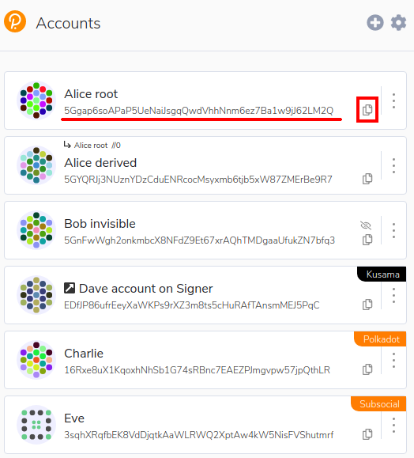

# Onboarding as citizen or eresident

Onboarding is required to:

* claim your LLM & LLD on-chain
* participate in governance
* act as a network validator

Onboarding on-chain has following steps:

1. Creating a Liberland wallet
2. Connecting your wallet address to your Liberland.org account
3. Setting your on-chain identity
4. Identity needs to be verified by Liberland official.

This guide will walk you through the required steps.

## Creating a Liberland Wallet

Liberland blockchain is a Polkadot-compatible network, but currently only the
Polkadot Browser Extension wallet is officially supported. To create a wallet:

1. Install a wallet manager, recommended is [Polkadot Browser Extension](https://polkadot.js.org/extension/)
2. Create a wallet - save your 12 word mnemonic phrase safely, ideally on paper
   * Copy your public key
   * 

## Connecting the wallet to Liberland.org account

To claim your LLM, LLD and citizenship or eresidency, you need to connect your
wallet address to the Liberland.org account. Note that after you do that, you
won't be able to change it without contacting Liberland.org administrators. To
connect your wallet address:

1. Go to [Liberland Website](https://liberland.org/en/update-profile)
2. Login, go to dashboard, under profile section click edit
3. On the Blockchain information section, set your public key as your wallet address

After setting the public key, you will automatically receive 1 LLD to your
wallet on Liberland Mainnet. It may take up to a few minutes. This 1 LLD is needed to pay for
transaction fees for setting your on-chain identity in next step.

Note: if you're on testnet, please ask for the initial 1 LLD on [Element](https://matrix.to/#/#liberland-node:matrix.org).

## Setting on-chain identity

To get your LLD, LLM and citizenship or eresidency status on-chain, you must
first set your on-chain identity. This on-chain identity will be public and will
officially connect your wallet address to your identity.

1. Login to the Liberland Blockchain App:
    * [Mainnet](https://blockchain.liberland.org/)
    * [Bastiat (testnet)](https://testnet.liberland.org/)
2. Go to the profile page:
    * [Mainnet](https://blockchain.liberland.org/home/profile)
    * [Bastiat (testnet)](https://testnet.liberland.org/home/profile)

3. Click **Update identity**
4. Update your details - note that you can do it even if you're not old enough, but your citizenship will only be activated on the date of your 13th birthday.
5. Contact the team on [Element](https://matrix.to/#/#liberland-node:matrix.org) to get your identity verified and LLD and LLM provided.