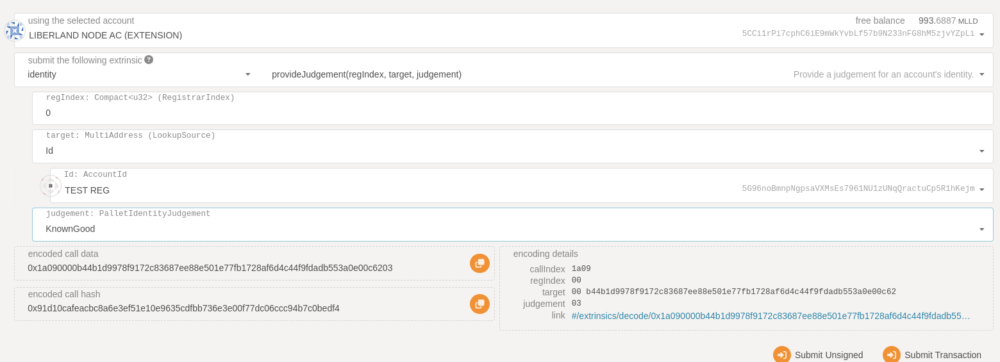

## Voting with LLM on-chain asset

Because of the design and implementation of LLM, LLM is not a native substrate
token. Instead, LLM is a custom extension to an on-chain asset. Liberland's
chain comes with a custom democracy voting integration, being the first chain
that allows users to vote with on-chain assets instead of the native substrate
balances.

* [Read more about on-chain assets here](https://marketplace.substrate.io/pallets/pallet-assets/)
* [In-depth LLM documentation](https://github.com/liberland/liberland_substrate/blob/develop/frame/llm/README.md)

## Setup enviroment:
We recommend that you manually clone the github repository and build it:

```
git clone https://github.com/liberland/liberland_substrate && cd liberland_substrate/ && cargo build --release
```

Run the node in dev mode to make things easy:
```
./target/release/substrate --dev
```

Navigate to [Polkadot.js](https://polkadot.js.org/apps/) and chooce local node.

### Become an on-chain citizen

In order to vote or interact with the political system, a user needs to become and on-chain citizen.
The requirements for being a citizen is:
* Identity set with the citizen field and `eligible_on` pointing to a past block number 
* `KnownGood` judgement from citizenship registrar
* Pooled llm

### Politic pooling LLM

1. Get some LLM: `polkadot.js > Developer > extrinsics > llm > fakeSend`
2. Allocate LLM for politics: `polkadot.js > Developer > extrinsics > llm > politicsLock`
3. Check your LLM balance by going to `Network > Assets > Balances`
3. Check your politics LLM balance by going to `Developer > chainstate > llm > llmPolitics`

## LLMPolitics

This is the amount of LLM you have allocated for Politics, these LLM can not be used for any type of non-voting functionality

## Unpooling

You can unpool 10% of your pooled LLM once a year. This will suspend your politics rights for a year.

To unpool, use `polkadot.js > Developer > extrinsics > llm > politicsUnlock`

## Set on-chain role

Once you have pooled LLM you can now go to `polkadot.js > Developer > extrinsics > identity > setIdentity`
Make sure you set the `citizen` field to raw and put `1` as the `Raw` input and `additional` containing item `(Raw: eligible_on, Raw: 0x0)`.

Submit the transaction!

#### Request judgement:

* `polkadot.js > Developer > extrinsics > identity > requestJudgement `
  * regIndex: 0
  * maxFee: 500

Now you need to either wait for someone to give you a judgement of KnownGood or do it yourself:



Now when you have become an on-chain citizen you can interact with the politics system with your pooled llm.

Head over to the Democracy tab and start interacting with your pooled llm.