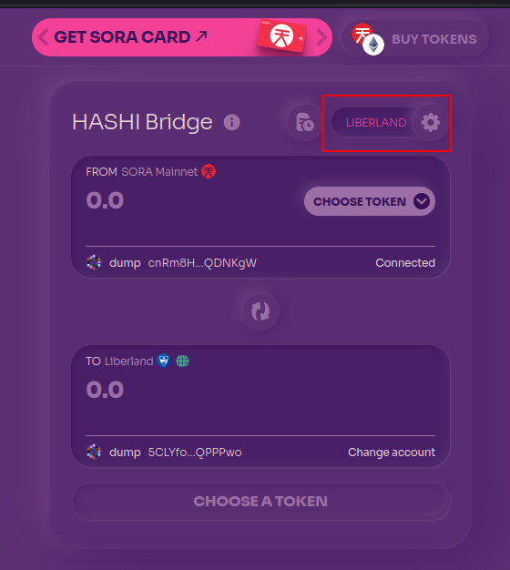
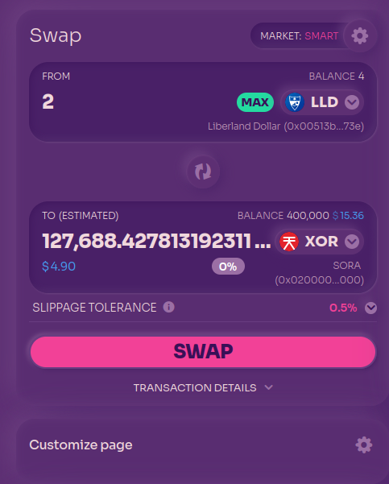
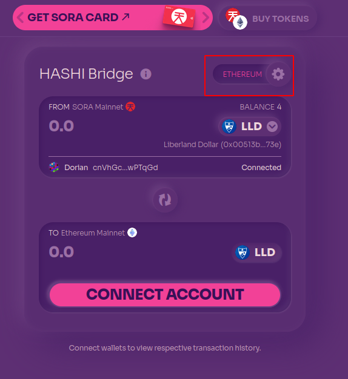

# Cross-chain bridging with HASHI

Liberland blockchain is connected to SORA and Ethereum through the [HASHI Bridge](https://polkaswap.io/#/bridge/). 
The bridge is permissionless so anyone can use it at any time.

LLD on Ethereum is further connected to [Solana through other bridges](./how-to-bridge-ethereum-solana.md). Bridges to TRON and BSC are coming soon.

To use the HASHI bridge, you will need native tokens on the chains you are bridging to and from.

For example, bridging from Liberland to SORA to Ethereum would require LLD, XOR and ETH for gas fees.

In addition, the bridge is a decentralised app (dApp) and therefore you need to use a wallet that can interact with dApps. For example, [a PC browser with a wallet extension](for-citizens/desktop-wallet.md) or [Subwallet](for-citizens/mobile-wallet.md) on mobile devices.

Edge Wallet will not work for this as it cannot connect or interact directly with dApps.

## Liberland <> SORA bridge
For this, you will just need LLD or XOR depending on the direction of bridging

- Go to [HASHI Bridge](https://polkaswap.io/#/bridge/).
- Connect your Substrate account that you will use for Liberland and SORA.
- Select the Liberland network.
- Choose the token you wish to bridge and the direction (Liberland to SORA or SORA to Liberland)

- Choose the amount and select 'Bridge'. Your wallet will ask you to confirm the necessary transactions.

## SORA <> Ethereum bridge

For bridging from SORA to Ethereum, you will need an Ethereum wallet with some ETH in it, and a Substrate account with some XOR in it.

### Getting XOR
If you bridged from Liberland, you can swap [LLD for XOR on Polkaswap](https://polkaswap.io/#/swap/LLD/XOR).
About 5 USDT of XOR should be enough, so 2 to 5 LLD swapped for XOR to be on the safe side.

Alternatively, if you bridged from Ethereum to SORA, you can sell some ETH for XOR instead.

Or DOT from Polkadot. Or KSM from Kusama. HASHI Bridge is amazing in this way, giving you options and not hamstringing you into needing to acquire the native coin first.

### Getting ETH
You need to have an Ethereum wallet with enough ETH to pay gas fees. We recommend at least 50 USD worth of ETH to have enough to bridge and open a position on a decentralised exchange (DEX).

### SORA <> ETH bridge

- With tokens and wallets ready, go to [HASHI bridge](https://polkaswap.io/#/bridge/)
- Select the Ethereum network
- Select the token
- Connect both substrate and ETH wallet (Subwallet supports both)
- Enter the amount and bridge! This may take a few minutes. 

After it's done, you may be prompted to add the token to your wallet. Accept and you should see it listed there, along with the number of tokens.

You are now ready to trade on DEXes such as [Uniswap](https://matcha.xyz/tokens/ethereum/0x054c9d4c6f4ea4e14391addd1812106c97d05690?buyChain=1&buyAddress=0xdac17f958d2ee523a2206206994597c13d831ec7&sellAmount=500).
