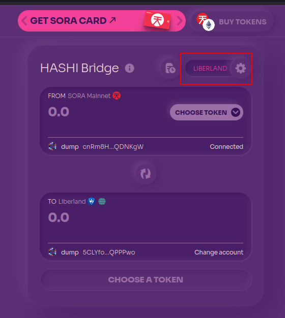
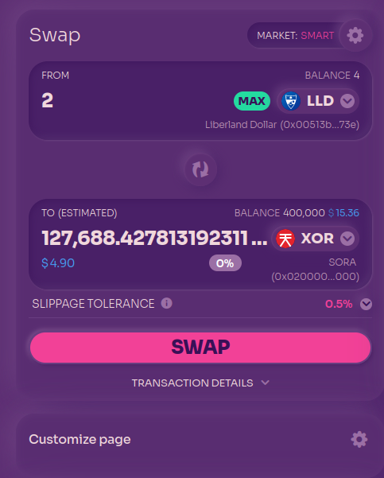
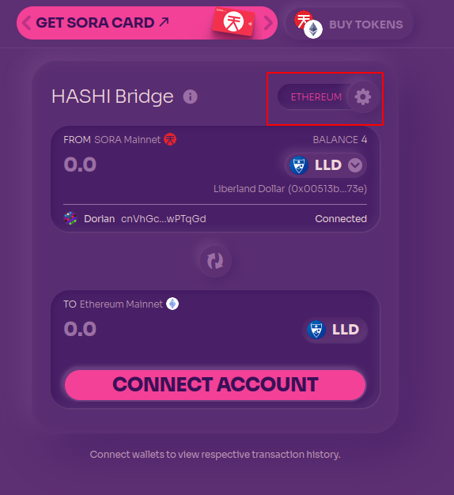

# How to Bridge to Ethereum

You can swap and bridge LLD through [Liberstake](https://exchange.liberstake.ll.land/).

## Current Bridge Status

The Liberland ↔ Ethereum bridging infrastructure is currently undergoing maintenance and final-stage integration work on the Liberland side.

The underlying  [HASHI Bridge](https://polkaswap.io/#/bridge/), the Liberland to Ethereum cross-chain bridge technology remains functional in general. However, the Liberland-specific routing and final validation steps are still being finalized and tested to ensure reliability and security.&#x20;

Bridging to and from Liberland is therefore temporarily unavailable. **But the Bridge will be ready soon.**

We are actively completing the remaining integration steps and debugging the final components. Once this process is complete, bridging functionality will be restored.

To use the HASHI bridge, you will need native tokens on the chains you are bridging to and from.

In addition, the bridge is a decentralised app (dApp) and therefore you need to use a wallet that can interact with dApps. For example, [a PC browser with a wallet extension](for-citizens/desktop-wallet.md) or [Subwallet](for-citizens/mobile-wallet.md) on mobile devices.

Edge Wallet will not work for this as it cannot connect or interact directly with dApps.

#### Important Notes

* Only use officially announced and supported bridge interfaces.
* Do not rely on third-party or unofficial services claiming to offer bridging functionality.
* Always verify announcements through official Liberland communication channels.

Further updates will be published as soon as the bridge is fully operational again.

### Liberland <> SORA bridge

For this, you will just need LLD or XOR depending on the direction of bridging

* Go to [HASHI Bridge](https://polkaswap.io/#/bridge/).
* Connect your Substrate account that you will use for Liberland and SORA.
* Select the Liberland network.
* Choose the token you wish to bridge and the direction (Liberland to SORA or SORA to Liberland)

* Choose the amount and select 'Bridge'. Your wallet will ask you to confirm the necessary transactions.

### SORA <> Ethereum bridge

For bridging from SORA to Ethereum, you will need an Ethereum wallet with some ETH in it, and a Substrate account with some XOR in it.

#### Getting XOR

If you bridged from Liberland, you can swap [LLD for XOR on Polkaswap](https://polkaswap.io/#/swap/LLD/XOR). About 5 USDT of XOR should be enough, so 2 to 5 LLD swapped for XOR to be on the safe side.

Alternatively, if you bridged from Ethereum to SORA, you can sell some ETH for XOR instead.

Or DOT from Polkadot. Or KSM from Kusama. HASHI Bridge is amazing in this way, giving you options and not hamstringing you into needing to acquire the native coin first.

#### Getting ETH

You need to have an Ethereum wallet with enough ETH to pay gas fees. We recommend at least 50 USD worth of ETH to have enough to bridge and open a position on a decentralised exchange (DEX).

#### SORA <> ETH bridge

* With tokens and wallets ready, go to [HASHI bridge](https://polkaswap.io/#/bridge/)
* Select the Ethereum network
* Select the token
* Connect both substrate and ETH wallet (Subwallet supports both)
* Enter the amount and bridge! This may take a few minutes.

After it's done, you may be prompted to add the token to your wallet. Accept and you should see it listed there, along with the number of tokens.

You are now ready to trade on DEXes such as [Uniswap](https://matcha.xyz/tokens/ethereum/0x054c9d4c6f4ea4e14391addd1812106c97d05690?buyChain=1\&buyAddress=0xdac17f958d2ee523a2206206994597c13d831ec7\&sellAmount=500).
