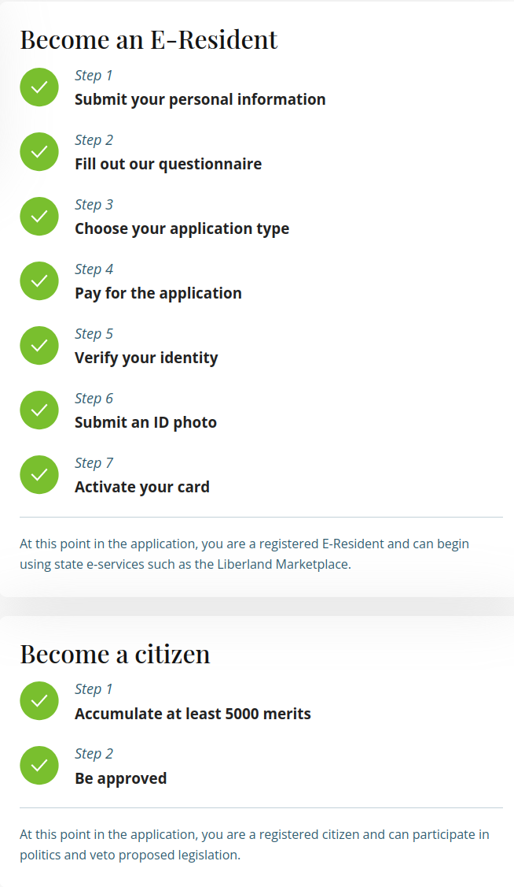

# Claiming e-residency and citizenship

To claim e-residency or citizenship of Liberland you need to complete the registration process at [www.liberland.org](www.liberland.org)

Follow the process in the [dashboard](https://liberland.org/dashboard)

If you are already supposed to have e-residency or citizenship (for example, by work in the settlement) 
but its not reflected in the system or it is asking you to pay, please contact info@liberland.org for help.

Do note that to complete the process we will need a good quality image of your face for your new Liberland passport
as well as good quality images of your existing ID to pass KYC.

