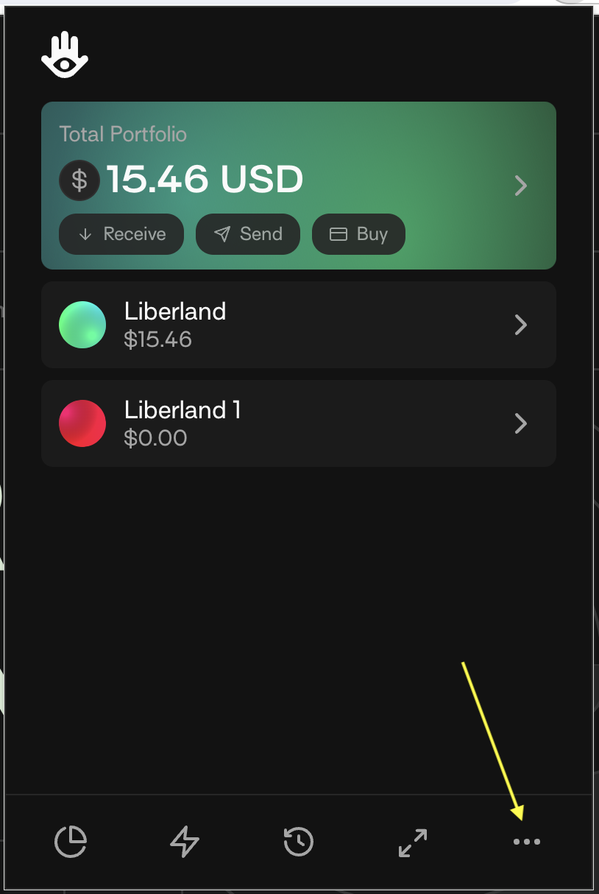
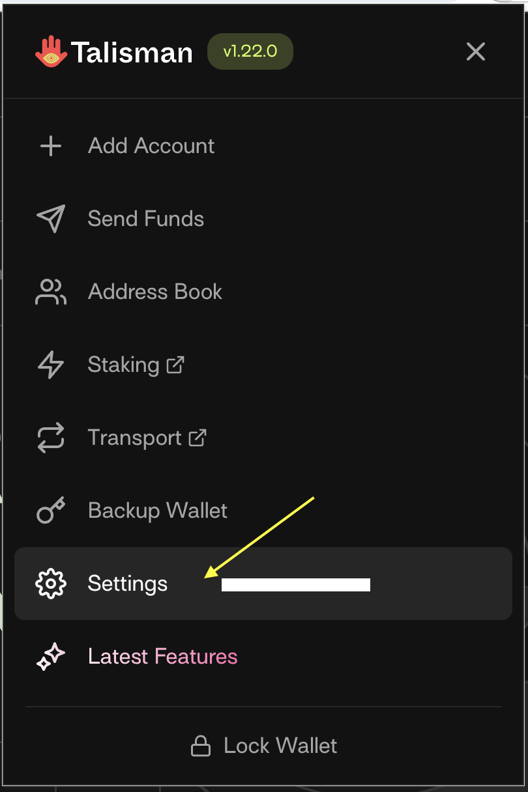
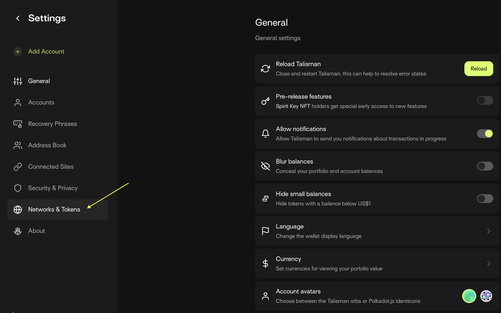
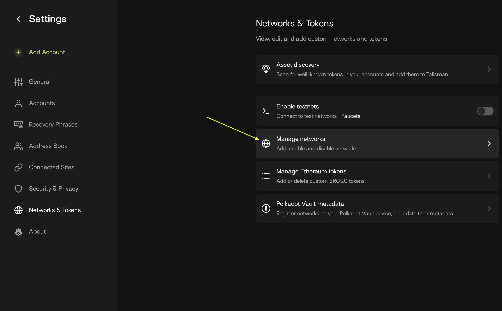
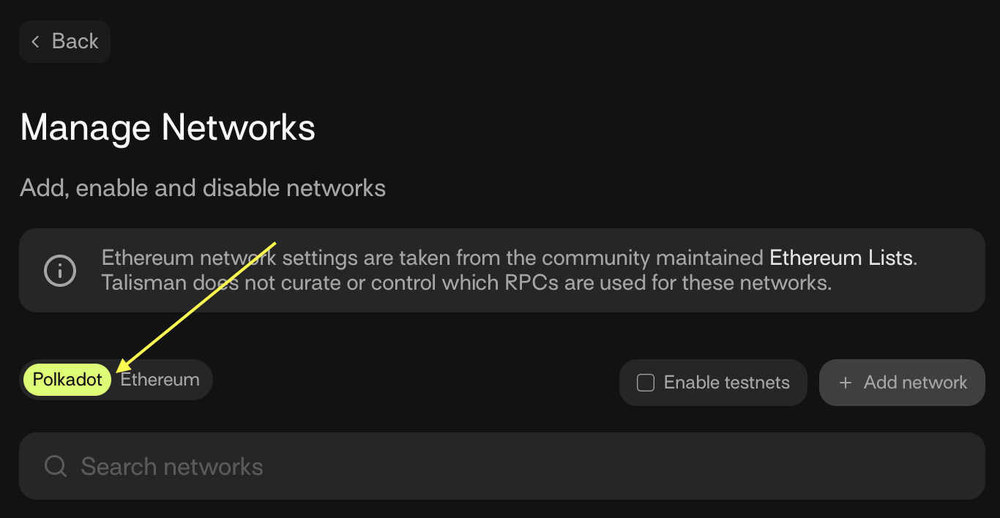
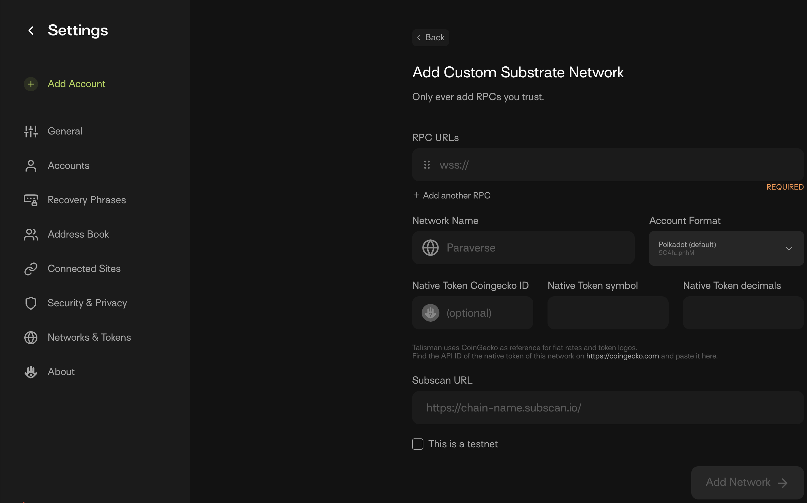
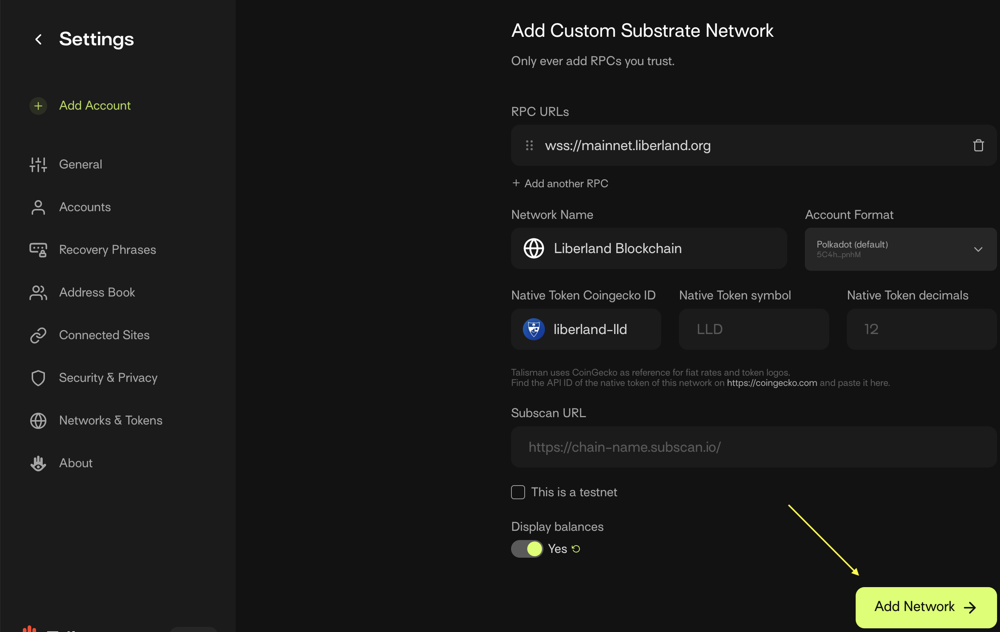

# Using desktop wallet with Liberland Blockchain

Liberland Blockchain supports using [Talisman Wallet](https://www.talisman.xyz/) for interacting with Liberland Blockchain and dApps. This guide will walk you through setting up the Talisman browser extension for Chrome and Chromium-based browsers (Opera, Arc, Brave, Edge, etc.).

## Install Talisman browser extension

[Install Talisman](https://www.talisman.xyz/download)

## Add account

Either create a new account or import an existing one.

If you're creating a new account, be sure to save the passphrase/private key in a secure location.

If you're importing an existing account for use on Liberland Blockchain, it must be an existing Polkadot account. 

## Add Liberland Network (Recommended)

* Select the ellipsis (three dots) in the bottom-right corner of Talisman

* Click `Settings`; this will open Talisman's settings in a new browser tab

* Click `Networks & Tokens` in the left-hand menu

* Click `Manage Networks` in the right-hand menu

* Click `Polkadot`

You will be shown a screen where you can enter Liberland Blockchain's details. They are as follows:

* In the `RPC URLs` field, enter `wss://mainnet.liberland.org`
  * Use `wss://testchain.liberland.org` for Bastiat testnet
* In the `Network Name` field, enter `Liberland Blockchain` or something similar
* Make sure `Account Format` says `Polkadot (default)`
* In the `Native Token Coingecko ID` field, enter `liberland-lld`
* Click `Add Network` and return to the portal

After a few seconds, you should see LLD in your list of networks. 

## Use Liberland Wallet dApp

To open the dApp, visit [blockchain.liberland.org](https://blockchain.liberland.org) in the same browser where you installed Talisman.

Now that you have a wallet, if you are a citizen or e-resident, you can begin [onboarding](https://liberland-1.gitbook.io/wiki/v/public-documents/blockchain/for-citizens/onboarding#id-3-getting-merits-and-residency). If you're using a desktop computer, adapt the instructions to use Talisman, Polkadotjs, or Subwallet browser extension instead of Subwallet's mobile app. 