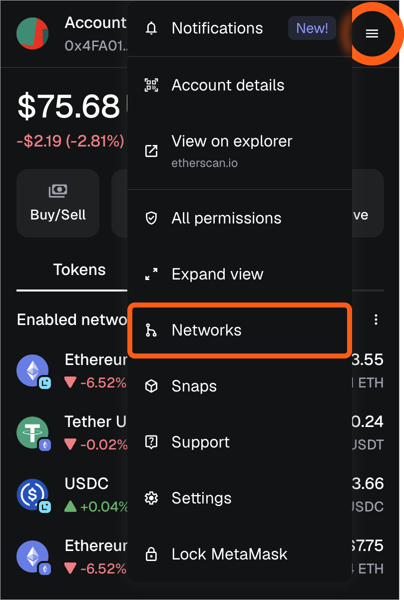
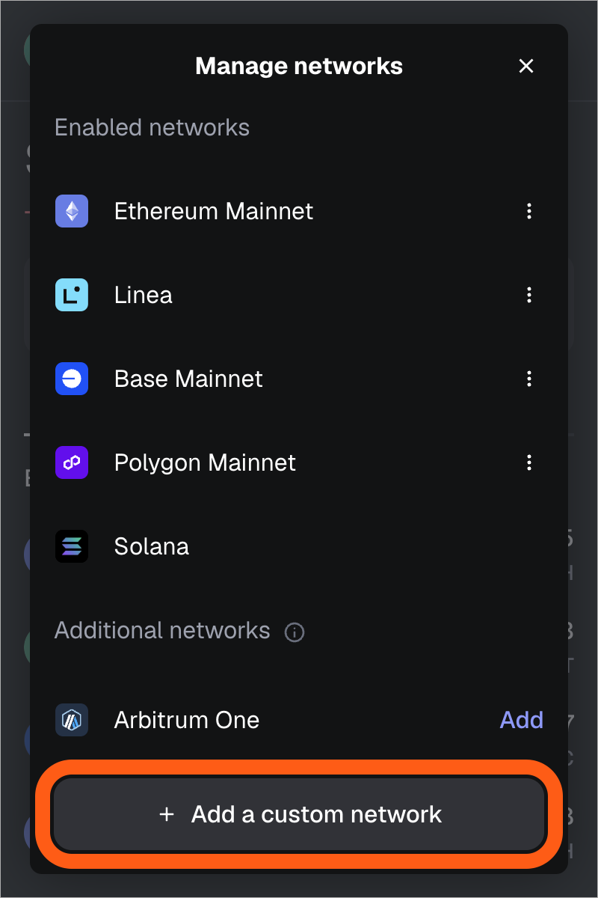
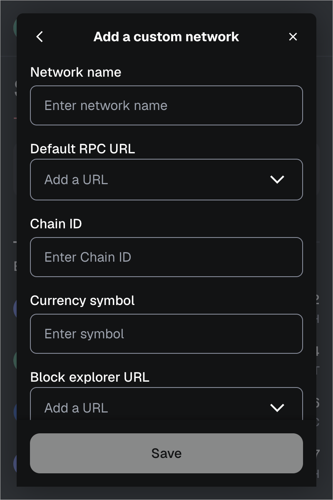

# How to Connect MetaMask to a Liberland Blockchain

This guide will walk you through adding the Liberland network to your MetaMask wallet. Liberland operates both a testnet and mainnet, and you can connect to either one.

## Prerequisites

- MetaMask wallet installed in your browser or mobile device
- Basic familiarity with cryptocurrency wallets

## Adding Liberland Network to MetaMask

**Step 1: Open MetaMask**

Click on the MetaMask extension icon in your browser to open your wallet.

**Step 2: Access Network Settings**

- Click on the network dropdown at the top of the MetaMask window (it likely shows "Ethereum Mainnet" or your current network)

- Scroll down and click "Add a custom network"

**Step 3: Enter Network Details**

You'll need to choose which Liberland network to add. Fill in the appropriate details:

**For Liberland Testnet:**

- **Network Name:** Liberland Testnet (or any name you prefer)
- **New RPC URL:** `https://testchain.liberland.org`
- **Chain ID:** `12865`
- **Currency Symbol:** `LDN`
- **Block Explorer URL:** leave blank

**For Liberland Mainnet:**

- **Network Name:** Liberland Mainnet (or any name you prefer)
- **New RPC URL:** `https://mainnet.liberland.org`
- **Chain ID:** `12864`
- **Currency Symbol:** `LLD`
- **Block Explorer URL:** leave blank

**Step 4: Save the Network**

Click "Save" to complete the process. MetaMask will automatically switch to your newly added network.

## Verifying Your Connection

After adding the network, you should see:

- The network name
- Your wallet address (same across all networks)
- A balance of 0 LDN (testnet) or 0 LLD (mainnet) unless you already have tokens

## Troubleshooting

**Connection Issues:**

- Verify you've entered the RPC URL correctly with no extra spaces
- Check that the Chain ID is exactly as specified
- Ensure you have a stable internet connection

**Network Not Appearing:**

- Try refreshing MetaMask or restarting your browser
- Make sure you clicked "Save" after entering the network details
