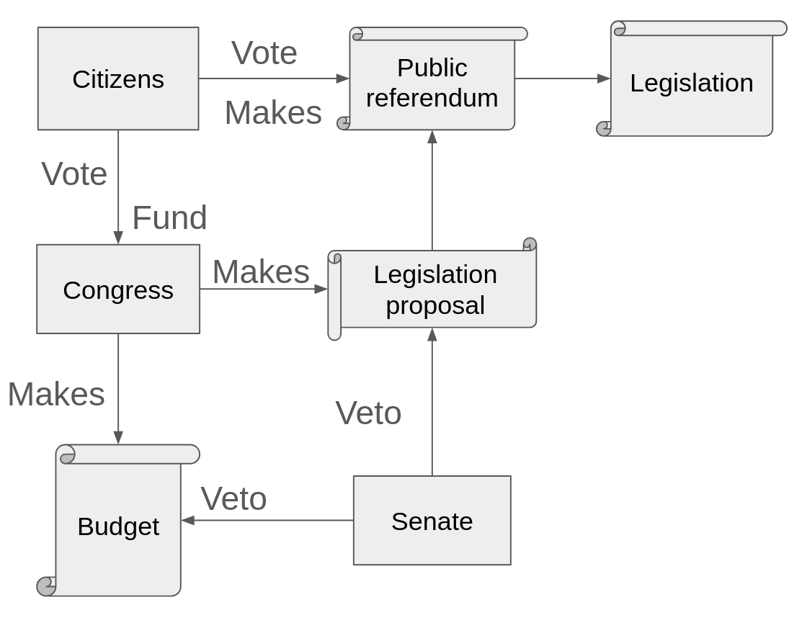

# Liberland governance

Liberland is based on the principles of minimal government, and this principle is reflected in the design of blockchain governance,
by adding many checks and balances. For example, a general theme is that for every way to do some government action, there are two ways
to cancel it

## Citizenship

Only citizens have political power in Liberland. A citizen is a wallet address connected to a physical person, with confirmed
on chain identity and 5000 politipooled (staked) merits.

Since citizenship is connected to a physical person, courts can transfer citizenship and staked merits to another account if citizens loses access.
Court can only touch 'citizen identity' and staked merits specifically. No other tokens can be touched by court onchain unless
explicitly allowed by some smart contract the citizen put tokens into.

Citizens can 'unpool'/unstake merits for a period of 1 month, during which they lose their political rights as they are considered to be on welfare.
Unpooling is at a rate of 0.8% of remaining merits per month, which equals to 10% a year. 
A citizen that drops below 5000 merits does not have political rights until pooled merit amount reaches back to 5000.

Only citizens can be validators, at 1 validator per 1 citizen. This ensures the blockchain remains in the hands of Liberlanders, and provides
some measure of network security even at small network size, as any takeover attempt would require not just getting a large amount of tokens,
but also a large amount of citizens too.

## Eresidents

Eresidents are allowed to open companies and participate in the (upcoming) Liberland stock exchange, but othwerise have no special
on-chain permissions.

## Citizenship office

Citizenship office onboards new citizens and eresidents onchain by giving them the 'confirmed identity' status and staking their
off-chain merits for them.
Currently the citizenship office can also 'take away' the citizenship by removing the identity confirmed status.
Citizenship office has administrator, set by root level call who appoints clerks, who do the set identity and send pooled merits actions.
Citizenship office requests merits for onboarding new citizens from the government when it runs low

### Future

In the future we will remove the ability of citizenship office to take away citizenships and make it so that congress appoints 
the 'minister of identity' - the admin account of the citizenship office

## Public referendum

Public referendum is a root level call able to call even setcode actions. Anyone can start a public referendum.
Only citizens can vote and they vote with their staked merits.

Referendums are expected to be mostly used for passing legislation, that is binding off-chain in the laws, courts and jurisdictions of Liberland

Referendums use [polkadots adaptive quorum biasing system](https://wiki.polkadot.network/docs/learn/learn-governance#adaptive-quorum-biasing) to calculate if they fail or pass

## Public Veto

Every legislation except for consitution and international treaty has a 'veto list'. Any citizen can cast a veto for legislation.
Once a legislation collects vetos numbering 50% of total number of citizen, any account can execute the onchain action to delete the legislation.
Public veto is the 'one citizen - one vote' part of Liberland governance

## Vault

There will only ever be 70 million merits and they are premined in the vault. 
10% of the remaining amount is released to congress and senate wallets every year (at a rate
of 0.8% per month). Vault is a technical account without private seed and it releases the funds alghoritmically. No onchain action,
not even sudo (unless setcode changes the code) can touch vault funds.

## Congress

Congress is the elected body of Liberland representatives. Citizen vote for congressmen at anytime with their merits,
and elections conclude every 90 days. 

[Read more about elections](voting.md)

Congress is supposed to pass budgets and legislation.

Congress is funded by LLD inflation, as well as income from new citizenships and voluntary donations.

Congress can pass budgets by itself, but any other action, such as legislation or technical referendum (including setcode referendum)
is turned into a privileged public referendum that has a bias to pass. This is copied over from [polkadots adaptive quorum biasing system](https://wiki.polkadot.network/docs/learn/learn-governance#adaptive-quorum-biasing).

Congress needs 50%+1 congressperson vote to pass a motion. Any congress motion can be cancelled by the senate

Absentee votes follow the prime congressman vote if they didnt vote at the time of voting period end.

## Senate

The senate is a safeguard of Liberland, consists of 100 seats kept for a lifetime. Senators have their own wallet which they can fund
and engage in shared project, but their main purpose is cancelling malicious congress spendings and referendum proposals, which
the senate can do with a 50%+1 vote

## Court

Feature in progress.
Court is supposed to be able to take away citizenships and staked merits when sufficiently serious crime happens.
Court can also be designated as a smart contract oracle in case contract enters dispute mode, but that is not part of governance.

## Sudo

Sudo is a 2/3 multisig of very trusted anonymous Liberlanders. Sudo is a temporary feature and will be removed soon. 
It is used mainly to push code upgrades during the period that the chain is still 'unfinished'

## Tech committee

Tech committee will replace sudo and will have the ability to do fast referendums about technical topics.
