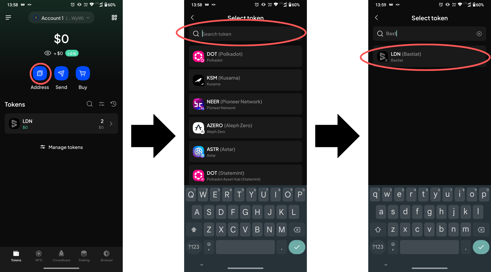
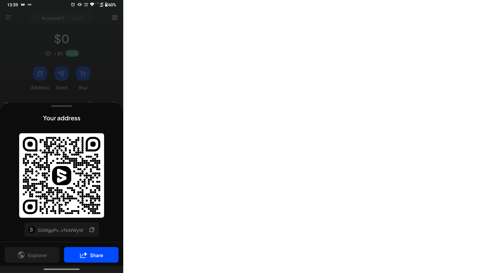

# Using mobile wallet with Liberland chain

Liberland chain supports using [SubWallet](https://www.subwallet.app/) for interacting with Liberland chain and dApps. This guide will walk you through setting up the SubWallet app.

## Install SubWallet

Follow the official [installation guide](https://docs.subwallet.app/main/mobile-app-user-guide/getting-started/install-subwallet-mobile)

## Add account

Either [create a new account](https://docs.subwallet.app/main/mobile-app-user-guide/account-management/create-a-new-account-with-new-seed-phrase) or [import an existing one](https://docs.subwallet.app/main/mobile-app-user-guide/account-management/import-restore-an-account)

## Add Liberland Network

1. Click the "hamburger" icon in top left corner
2. Select **Manage Networks**
3. Click **+** icon in top right corner

    
4. Enter `wss://mainnet.liberland.org` in the `Provider URL` field
    * use `wss://testchain.liberland.org` for Bastiat testnet
5. Confirm - fields **Chain name**, **Symbol** and **Chain type** should fill automatically
6. Click **Save**

## Get address of your wallet

1. Click the **Address** button
2. In **Search tokens** field input **Liberland**
   * use **Bastiat** for testnet
3. Click the **LLD** token
   * use **LDN** for Bastiat
4. You now can copy, scan or share your address.

## Use Liberland Wallet dApp

1. Click the **Browser** button on bottom menu
2. Input `https://blockchain.liberland.org/` in **Search or enter website** field
   * Use `https://testnet.liberland.org/` for Bastiat
3. Confirm, page should load

    
4. Click the grey checkmark button next to the account you want to connect to the dApp - it should turn green
5. Click **Connect**
6. You may now login as usual.
