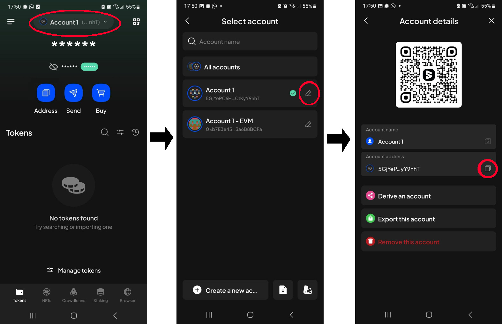
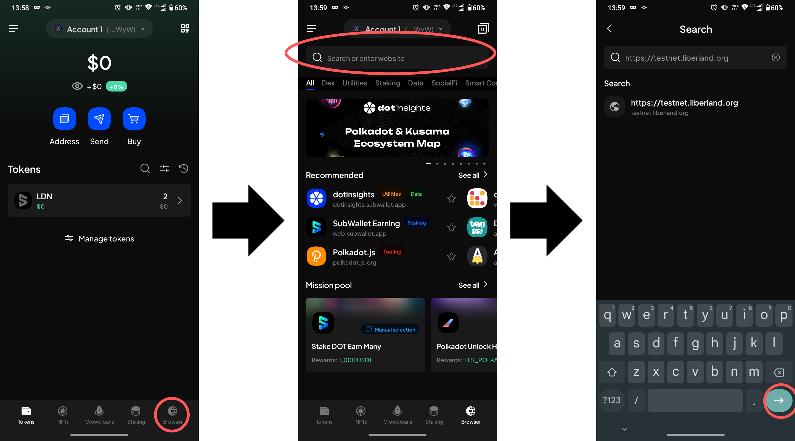
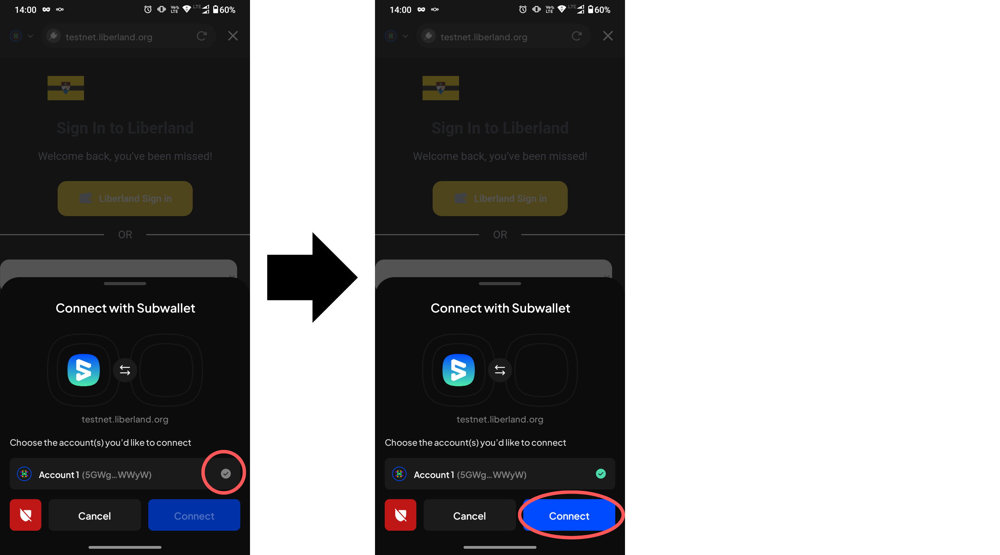
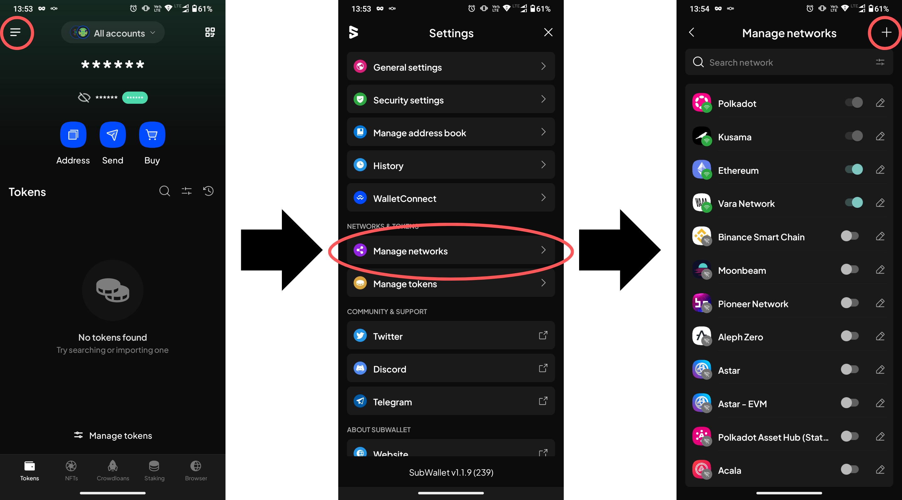

# Using mobile wallet with Liberland Blockchain

Liberland Blockchain supports using [SubWallet](https://www.subwallet.app/) for interacting with Liberland Blockchain and dApps. This guide will walk you through setting up the SubWallet app.

## Install SubWallet

[Install SubWallet](https://www.subwallet.app/download.html)

## Add account

Either [create a new account](https://docs.subwallet.app/main/mobile-app-user-guide/account-management/create-a-new-account-with-new-seed-phrase) or [import an existing one](https://docs.subwallet.app/main/mobile-app-user-guide/account-management/import-restore-an-account).

If you're importing an existing account for use on Liberland Blockchain, it must be an existing Polkadot account. 

## Get your wallet address

* Tap your `Account` at the top (not the button)
* Tap the `pencil icon`
* Next to `Account Address`, click the copy icon (two pieces of paper)
* Tap the `X` in the top-right corner to return to the app's home screen

## Use Liberland Wallet dApp

* Tap the `Browser` button in the bottom menu
* In the `Search or enter website` field, input `https://blockchain.liberland.org/`
* Confirm, and the page should load

    
* Tap the account you wish to connect to the dApp - the checkmark to the right should turn green
* Tap `Connect`
* You may now login to the dApp and complete the [Onboarding](onboarding.md).

## Add Liberland Network (Optional)

* From the home screen, tap the menu icon in top-left corner
* Tap `Manage Networks`
* Tap `+` icon in the top-right corner

* In the `Provider URL` field, enter `wss://mainnet.liberland.org` and confirm
   * use `wss://testchain.liberland.org` for Bastiat testnet
* Once confirmed, the `Chain name`, `Symbol` and `Chain type` fields should fill automatically
* Tap `Save`, and return to the home screen
