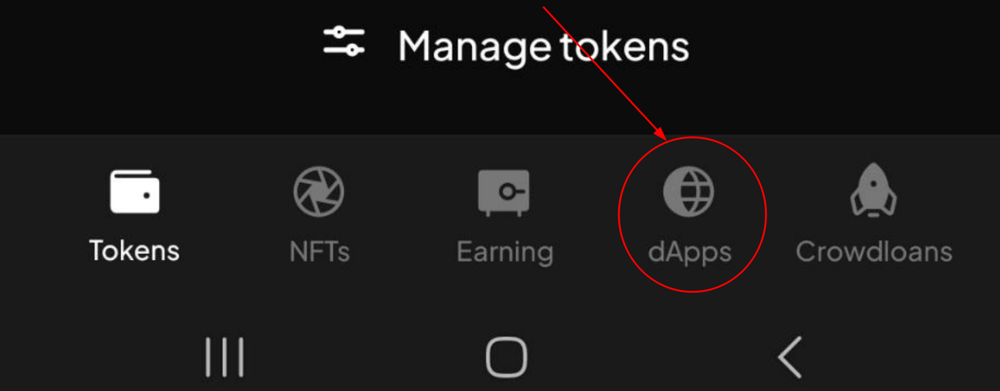
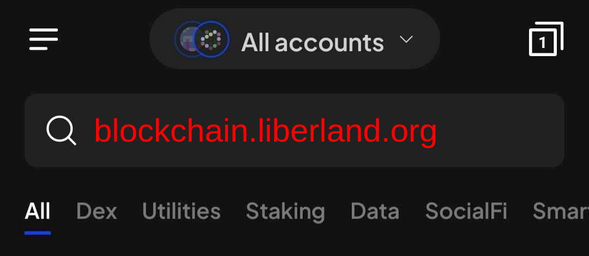

# For Citizens and e-residents

The *onboarding* process described below allows you to connect the SubWallet crypto wallet with your Liberland account. This will allow you to:
* Claim your citizenship or e-residency as an NFT.
* Claim, stake and earn Liberland Merits (LLM) and Liberland Dollars (LLD).

## Summary

1. Make sure you are an e-resident/citizen with correct merits on [liberland.org](www.liberland.org)
2. [Install SubWallet](https://www.subwallet.app/download.html), create wallet and save passphrase on paper
3. In SubWallet browser, go to [https://blockchain.liberland.org](https://blockchain.liberland.org) and follow the steps
4. Click on profile, claim onboarding LLD, and update identity

You will then get your merits within a day!

   

   

## Detailed Guide
Migrating your identity from [liberland.org](www.liberland.org) to Liberland Blockchain requires roughly 3 minutes and consists of a few steps:
1. Setting up a wallet
2. Securing your keys
3. Getting Merits and residency at liberland.org
4. Claiming Merits and citizenship on-chain

### 1 - Setting up a wallet
* A wallet address is your public address on the blockchain.
* It comes with a seed phrase - 12 words that are the keys to your on-chain existence.
* Use SubWallet or polkadotjs.

[Mobile wallet setup](mobile-wallet.md)

[Desktop wallet setup](../how-to-create-wallet.md)

### 2 -  Securing keys
* During the wallet setup, you got a 12-word mnemonic seed phrase. **It is very important not to lose or share that phrase with anyone,**
as it is the key or 'password' to your on-chain existence. Make sure to back it up and store it somewhere where it will not be lost.
* A common, low-tech solution is to write it on a piece of paper or use a password manager.

### 3 - Getting Merits and residency
* Log in to [liberland.org](https://liberland.org)

* Make sure your Merits value and residency/citizenship status are accurate in [liberland.org](www.liberland.org).
* If you do not see accurate values, ping whomever promised your Merits or residency/citizenship status to resolve the inaccuracy.

It should look something like this:

### 4 - Connect SubWallet to Your Liberland Account

At this point, you should have your public wallet address, your 12-word mnemonic phrase safely stored, and your Liberland profile updated with your wallet address, Merits, and residency/citizenship status saved at [liberland.org](www.liberland.org).

If on a desktop, do the next steps using a browser you have polkadotjs or SubWallet installed on (e.g. Firefox, Chrome, etc.).

If on mobile, **you must use the SubWallet app's built-in browser located in the lower-right corner of the app.**

* **In the SubWallet app's built-in browser**, enter the [https://blockchain.liberland.org](https://blockchain.liberland.org) address, then:
  1. Make sure your SubWallet address is selected in the dropdown menu, you may see your address two times, it doesn't matter which do you select.
  2. After selecting your SubWallet address, log in to your Liberland account and approve connection with SubWallet.
  3. In a few seconds, the Liberland news page will load, which means the process has finished successfully. Do not leave the **SubWallet app's built-in browser** yet, follow the step to claim your

### 5 - Claim Your Tokens and Resident/Citizen Identity
1. On the *blockchain.liberland.org* page open through the **SubWallet app's built-in browser**, go to the menu (3 bars), and tap/click the 'Profile' text.
2. At the bottom of the Profile page, select the **Claim complimentary LLD** button. After a few seconds, it should tell you to refresh the page and you should have 2 LLDs so that you can begin using the blockchain right away. Since all actions on-chain cost a small amount of gas fees and you are already a resident, you are eligible for a small amount of LLD to get you started. This small amount of LLDs will allow you to transact your citizenship/residency NFT and LLM to your SubWallet address.
3. Next, select the **Update identity** on the Profile page, and set it to what you want your on-chain identity to be. **There is no requirement to use your real name,** but make sure to include your correct citizenship/residency status.
4. Fill in the pop-up form and Select the **Set identity** button. As with any on-chain transaction, a popup window from your wallet of choice should appear, and it will ask you to sign the transaction. Some browsers might prevent popup windows, so make sure to click on the wallet extension icon if you see no popup. In any case, sign the transaction and you are good to go.

Congratulations!

It usually takes about a day for the Ministry of Interior to confirm your on-chain identity and transfer your merits.
