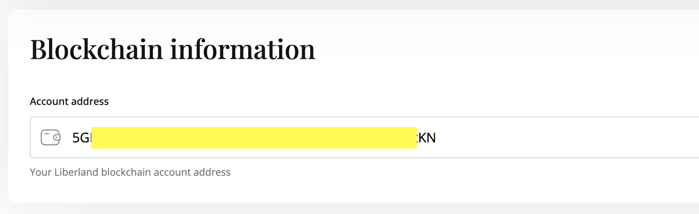

# For Citizens and e-residents

This guide is written with SubWallet's mobile app in mind. 

## TLDR

1. Make sure you are an e-resident/citizen with correct number of Merits on [liberland.org](www.liberland.org)
2. [Install SubWallet](https://www.subwallet.app/download.html), create wallet and save passphrase on paper
3. Go to [blockchain.liberland.org in subwallet](https://mobile.subwallet.app/browser?url=https%3A%2F%2Fblockchain.liberland.org%2F) and follow the steps
4. Click on profile, claim onboarding LLD and update identity

You will then get your Merits within one business day!

   

   

## Onboarding
Migrating your identity from [liberland.org](www.liberland.org) to Liberland Blockchain requires roughly 3 minutes and consists of a few steps:
1. Setting up a wallet
2. Securing your keys
3. Getting Merits and residency at liberland.org
4. Claiming Merits and citizenship on-chain

### 1 - Setting up a wallet
* A wallet address is your public address on the blockchain.
* It comes with a seed phrase - 12 words that are the keys to your on-chain existence.
* Use SubWallet or polkadotjs.

[Mobile wallet setup](mobile-wallet.md)

[Desktop wallet setup](desktop-wallet.md)

### 2 -  Securing keys
* During the wallet setup, you got a 12 word mnemonic seed phrase. **It is very important not to lose or share that phrase with anyone,** as it is the key or 'password' to your on-chain existence. Make sure to back it up and store it somewhere where it will not be lost.
* A common, low-tech solution is to write it on a piece of paper or use a password manager.

### 3 - Getting Merits and residency
* Log in to [liberland.org](https://liberland.org)
* Make sure your Merits value and residency/citizenship status are accurate in [liberland.org](www.liberland.org).
* If you do not see accurate values, ping whomever promised your Merits or residency/citizenship status to resolve the inaccuracy.

It should look something like this:

### 4 - Claim Merits and status on-chain

Now it's time to log in to [liberland.org](www.liberland.org), and then:

1. Select 'Dashboard'
2. Select 'Edit profile'
3. Scroll down to 'Blockchain information,' and paste your wallet address in this field 4. Select 'Save changes'

At this point you should have your public wallet address, your 12-word mnemonic phrase safely stored, and your Liberland profile updated with your wallet address, Merits, and residency/citizenship status saved at [liberland.org](www.liberland.org).

If on desktop, do the next steps using a browser you have Talisman, SubWallet, or PolkadotJs installed on (e.g. Firefox, Chrome, etc.).

If on mobile, **you must use the SubWallet app's built-in browser located in bottom menu in the app.** The button says 'dApps'.

* Navigate to [https://blockchain.liberland.org](https://blockchain.liberland.org), login and follow the steps.

* It's time to claim your tokens and e-resident/citizen identity!
* Open the menu and select the 'Profile' tab.
* Since all actions on-chain cost a small amount of gas fees and you are already an e-resident, you are eligible for a small amount of LLD to get you started.
* First, select on the 'Claim complimentary LLD' button. After a few seconds, it should tell you to refresh the page and you should have 2 LLDs so that you can begin using the blockchain right away.
* Next, select on 'Update identity', and set it to what you want your on-chain identity to be. **There is no requirement to use your real name,** but make sure to include your correct citizenship/e-residency status.
* After you select on 'Set identity', as with any on-chain transaction, a popup window from your wallet of choice should appear, and it will ask you to sign a transaction.
Some browsers might prevent popup windows, so make sure to click on the wallet extension icon if you see no popup. In any case, sign the transaction and you are good to go.
* After this, it usually takes approximately one day for the Ministry of Interior to confirm your on-chain identity and transfer your Merits.

Please wait patiently for the on-chain identity and transfer process to be completed as it is a manual process at this time.