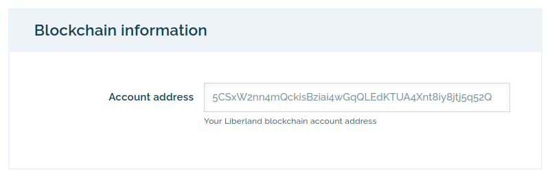
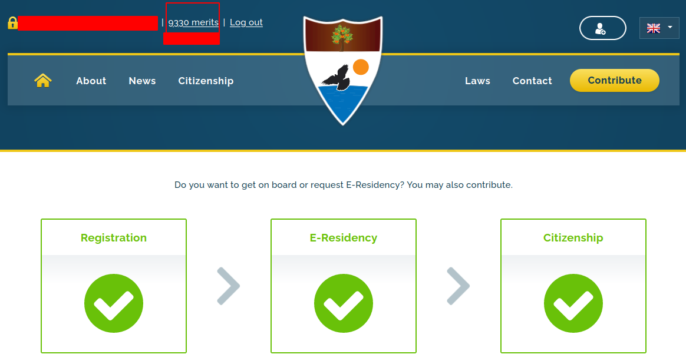
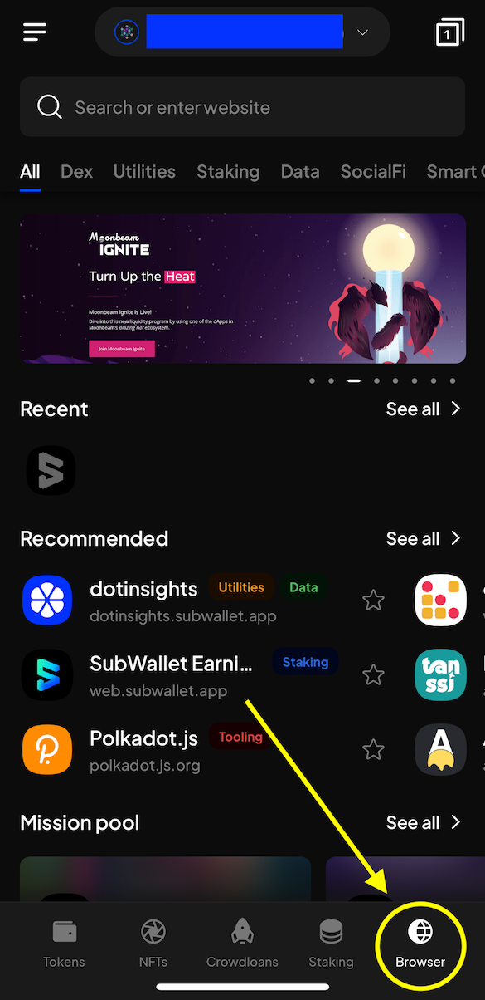
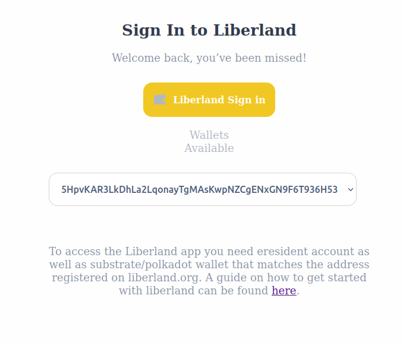

# For Citizens and e-residents

## Onboarding
Migrating your identity from [liberland.org](www.liberland.org) to Liberland Blockchain requires roughly 5 minutes and consists of a few steps:
1. Setting up a wallet
2. Securing your keys
3. Getting Merits and residency at liberland.org
4. Claiming Merits and citizenship on-chain

### 1 - Setting up a wallet
* A wallet address is your public address on the blockchain.
* It comes with a seed phrase - 12 words that are the keys to your on-chain existence.
* At this time, recommended wallets are SubWallet or polkadotjs.
* Set up a wallet and get your address.

[Mobile wallet setup](mobile-wallet.md)

[Desktop wallet setup](../how-to-create-wallet.md)

### 2 -  Securing keys
* During the wallet setup phase, you got a 12 word mnemonic seed phrase. **It is very important not to lose or share that phrase with anyone,**
as it is the key or 'password' to your on-chain existence. Make sure to back it up and store it somewhere where it will not be lost.
* A common, low-tech solution is to write it on a piece of paper. A password manager is also a good option.

### 3 - Getting Merits and residency
* Log in to [liberland.org](https://liberland.org) and visit the [profile editing page](https://liberland.org/en/update-profile)

* Make sure your Merits value and residency/citizenship status are accurate in [liberland.org](www.liberland.org).
* Make sure you have the correct amount of Merits and residency/citizenship status.
* If you do not see accurate values, ping whomever promised your Merits or residency/citizenship status to resolve the inaccuracy.

It should look something like this:

### 4 - Claim Merits and status on-chain

At this point you should have your public wallet address, your 12-word mnemonic phrase safely stored, and your Liberland profile updated with your wallet address, Merits, and residency/citizenship status saved at [liberland.org](www.liberland.org).

If on desktop, do the next steps using a browser you have polkadotjs or subwallet installed on (e.g. Firefox, Edge, Chrome, Brave, Opera, etc.).

If on mobile, **you must use the SubWallet app's built-in browser located in lower-right corner in the app.**

* Navigate to [https://blockchain.liberland.org](https://blockchain.liberland.org)
* Your wallet address should be visible on-screen. If it isn't, make sure you have installed the wallet correctly or, if on mobile, that you are using SubWallet's built-in browser.

* Next, select **Liberland Sign in**. After signing up, you should be logged in!
* Its time to claim your tokens and resident/citizen identity!
* Open the menu and select the **Profile** tab.
* Since all actions on-chain cost a small amount of gas fees and you are already a resident, you are eligible for a small amount of LLD to get you started.
* First, select on the **Claim complimentary LLD** button. After a few seconds, it should tell you to refresh the page and you should have 2 LLDs so that you can begin using the blockchain right away.
* Next, select on **Update identity**, and set it to what you want your on-chain identity to be. **There is no requirement to use your real name,** but make sure to include your correct citizenship/residency status.
* After you select on **Set identity**, as with any onchain transaction, a popup window from your wallet of choice should appear, and it will ask you to sign a transaction.
Some browsers might prevent popup windows, so make sure to click on the wallet extension icon if you see no popup. In any case, sign the transaction and you are good to go.
* After this, it usually takes about a day for the Ministry of Interior to confirm your on-chain identity and transfer your merits.
