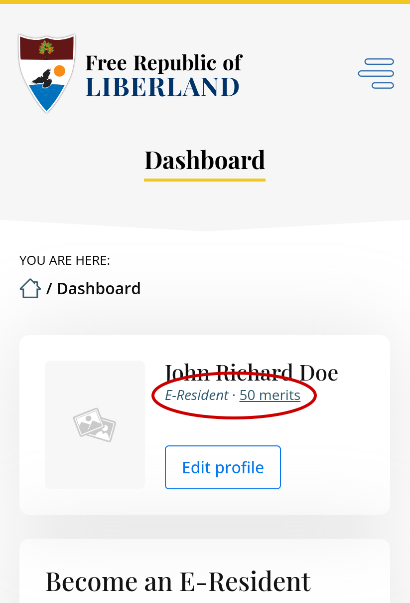

# Onboarding

This guide is written with SubWallet's mobile app in mind. If you are using another wallet on mobile (e.g., Talisman) or are a web/computer user (using e.g., polkadot{.js}), you can easily adapt the instructions accordingly to the wallet/platform you are using.

## Quick guide

1. Make sure you are an E-Resident/citizen with correct number of merits on [the main website](https://liberland.org).
2. [Install SubWallet](https://www.subwallet.app/download.html), create a wallet, and save the passphrase on paper.
3. Go to the Liberland Blockchain at [blockchain.liberland.org](https://blockchain.liberland.org/liberland-login) and follow the steps.

You will then get your merits transferred to your blockchain wallet in about one business day.

## Step-by-step guide
Setting up your identity on the Liberland Blockchain requires roughly 3 minutes and consists of a few steps:
1. Getting merits and residency on the website
2. Setting up a wallet
3. Securing your keys
4. Claiming merits and E-Residency/citizenship on chain

### 1. Get merits and E-Residency/citizenship
1. Go to [the Dashboard](https://liberland.org/dashboard) of the main website.
2. Make sure your merits and E-Residency/citizenship status are accurate in the Dashboard. It should look something like this: 
3. If you do not see accurate values, contact whomever promised you merits or E-Residency/citizenship status to resolve the inaccuracy.

### 2. Set up a wallet
A wallet address is your public address on the blockchain. It comes with a seed phrase&mdash;12 words that are the keys to your on-chain existence.

Use SubWallet, polkadot{.js}, or Talisman as your wallet software based on your platform:

[Mobile wallet setup](mobile-wallet.md)

[Web wallet setup](desktop-wallet.md)

### 3.  Secure keys
During wallet setup, you got a 12-word mnemonic seed phrase. Store it somewhere where it will not be lost nor found by someone else.


It is ***very important*** not to lose that phrase or share it with anyone, as it is the only key or "password" to your on-chain existence.


A common, low-tech solution is to write it on a piece of paper and put it in a safe, or to use a password manager. Taking a photo of it on your phone or the like is *not recommended* because it is mostly likely not encrypted and someone else might see it.

### 4. Claim merits and status on chain

Go to [https://blockchain.liberland.org](https://blockchain.liberland.org/liberland-login) and follow the steps.

If on the web, do the next steps using the browser you have SubWallet, polkadot{.js}, or Talisman installed on (e.g. Chrome, Firefox, etc.).

If on a mobile device, *you must use the SubWallet app's built-in browser located in bottom menu in the app.* The button says **dApps**.

1. Navigate to [https://blockchain.liberland.org](https://blockchain.liberland.org/liberland-login) and log in. 
2. It's time to claim your tokens and E-Resident/citizen identity! The dApp should guide you through it, but in case something went wrong, the manual process is as follows: Open the menu and click on the **Profile** button.


Since all actions on-chain cost a small amount of gas fees and you are already an E-Resident, you are eligible for a small amount of LLD to get you started.


3. First, click the **Claim complimentary LLD** button. After a few seconds, it should tell you to refresh the page and you should have LLD&nbsp;2 so that you can begin using the blockchain right away.
4. Click **Update identity**, and set it to what you want your on-chain identity to be.


**Note:** There is no requirement to use your real name, but make sure to include your correct citizenship/E-Residency status.


5. After you click **Set identity**, as with any on-chain transaction, a popup window from your wallet of choice should appear, and it will ask you to sign the transaction. Sign the transaction and you are good to go.


**Note:** Some browsers might prevent popup windows, so make sure to click on the wallet extension icon if you see no popup.


6. After this, it usually takes approximately one day for the Ministry of Interior to confirm your on-chain identity and transfer your merits.


Please wait for the on-chain identity and transfer process to be completed, as it is a manual process at this time.

