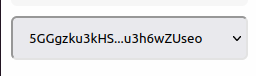

## Running Liberland registered companies
So you have decided to pioneer liberty and decentralization by opening a company and doing business in Liberland.

The benefits of a Liberland company are a less regulated and untaxed business environment,
access to Liberland clients, markets, and justice system, as well as bragging rights
and the patriotic contribution to the official GDP of Liberland.

Given the early stage of Liberland and its current status as a country not yet recognized by the UN,
Its important to note that Liberland companies are not a way to evade tax in other countries, for example
if you are selling physical products in the US to US clients with US workers, a Liberland company will not help in
reducing tax obligations as far as US bureaucracy is concerned.

If your company is either operating online or with crypto or with clients from Liberland or in the territory of Liberland itself however, opening a Liberland company makes sense.

This article will explain how to create a company to operate in Liberland's blockchain system and economy
or open a subsidiary of another company, 
how to handle payments either in Liberland itself or internationally or on-chain,
how to sign and enforce legally binding contracts in Liberland or international jurisdictions, 
and how to issue stock or other assets and list on the Liberland stock market.

You will need to spend between 10 and 250 LLD for the process.
//TODO how to get LLD

[Browse existing companies](www.blockchain.liberland.org/home/registries/allCompanies)

[Browse existing Contracts](www.blockchain.liberland.org/home/contracts/overview)

### Choosing personal or company account
Any person, wallet address of account can create a company in on the Liberland blockchain, 
however to be officially registered as a business within the nation
of Liberland it needs to satisfy some minimal requirements such as being an e-resident of Liberland.

[How to become an e-resident](../for-citizens/claiming-residency.md)

The first decision is choosing whether you want to open a company under your own personal account/wallet or to create a new company account.

We recommend setting up a new company account (wallet address) to keep business transactions and contracts separate from your personal finances. 
However, if you're the sole person in your company, you might prefer to use your personal account. 
This choice depends on your business needs.

It is easy to switch between many accounts at [blockchain.liberland.org](blockchain.liberland.org) in the menu wallet selector.

After selecting an account, ensure to update your identity details, including your display name and contact information on your profile page. 
This step is crucial as it enables others to easily transfer tokens to your address by searching for your display name through the wallet at [blockchain.liberland.org](blockchain.liberland.org).
TODO UPDATE PROFILE LINK
TODO SEND TOKENS BY DISPLAY NAME PICTURE

### Choose company type

There are 4 main company types to consider, depending on your business needs and risk tolerance.

#### "Goodboi" subsidiary company
The "goodboi" company structure is the one that assumes a hostile institution from another country is looking into your
activity in Liberland, and attempts to be maximally compliant in the case your country of residence assumes the non-existence
of your Liberland company.

The benefits of a "Goodboi" company are a less regulated business environment, 
access to Liberland clients, markets, and justice system, as well as bragging rights
and the patriotic contribution to the official GDP of Liberland.

In a 'goodboi' company structure, you are required to report all your income to your country of residence and pay all
the taxes on your income that your country of residence requires.

A parralel company must exist in your country of residence.

Any money earned in Liberland as this company that you want to spend in your other country
should be converted into LLD or other widely tradeable currencies, exchanged for fiat on the exchange and paid out to your main company bank account.
Normally, only this last fiat transaction needs to be reported in the other country.

Note that regulations vary from country to country so make sure to follow the local law, but this process should be sufficient for small
businesses in USA and EU.

//TODO goodboi contract

#### Territorial tax residency company
If you live in a country that doesnt have worldwide tax obligations for residents and citizens and instead has territorial
based taxation, such as Panama, Costa Rica or others, and you sell services in Liberland, online, on Liberland blockchain
or use other crypto in business, you can open a Liberland company with Liberland(aka voluntary) tax obligations.

These kinds of companies can also open bank accounts. //TODO how

// TODO Contract

#### Pure Liberland company
Pure Liberland company is physically headquartered in Liberland by people who physically and legally live only in Liberland.

In this case, only Liberland law and voluntary tax code need to be followed.

// TODO Contract

#### Other
Liberland has very little regulations about company structures, so trusts, DAOs, NGOs and all other kinds of entities
are possible, as long as you have a valid contract, follow Liberland law and dont use Liberland companies
for international fraud/crime, you can register it.

Here are just some of the examples
TODO trusts
TODO DAOs
TODO NGOs

### Create contracts (optional)

In addition to your charter contract that you should register on chain,
Your company may be subject to other legally binding agreements in accordance with Liberland law,
or you may choose to execute and register contracts with clients or other stakeholders.
Should you desire, it is possible to directly include these agreements within your company registration.

[Browse existing Contracts](www.blockchain.liberland.org/home/contracts/overview)

To create a contract,

TODO CONTRACT CREATION

Please be aware that drafting contracts may necessitate legal expertise specific to the law of Liberland to ensure they are correctly established.
Do not hesitate to seek assistance; there may be companies and professionals available who specialize in providing these services.

We are working on a easy to use contract builder but it will take time to finish.

Once the contract is finalized, please copy its link and distribute it to the relevant parties and judges for their signatures.
The most frequently utilized 'judge' for this purpose is the official court of Liberland, which can be contacted here.
TODO ADD LIBERLAND COURT CONTACT

### Create company
To create a company, in [blockchain.liberland.org](blockchain.liberland.org) choose registries on the menu and select My companies -> Register company

This action will lead you to a form for requesting company registration.
Not all fields are required, so you may omit any that are not applicable to your situation.

Regarding 'Editable by registrar' field, its best to enable it.
This allows the Liberland company registrar to modify your company's information if your account becomes inaccessible 
or if you are legally found to have violated laws. 
It is important to note that most registrars require this option to be selected for company registration.

Sign the transaction and your company request for registration is ready! It should take about a day for the request to be approved.

After it is approved you can get your certificate of incorporation by clicking the button 

TODO GENERATING CERTIFICATE OF INCORPORATION

Your company will also appear in the 
[list of Liberland companies](www.blockchain.liberland.org/home/registries/allCompanies)

### Handling payments

Although Liberland does not impose specific regulations regarding the methods, currencies, or reporting of payments, 
conducting business transactions on the Liberland blockchain is advisable as it is good for Liberland's further development, 
particularly when engaging in legally binding contracts.

Assets that are currently available on Liberland blockchain are LLM, LLD and stablecoins like LLEUR and USDT.
While Bitcoin and other cryptocurrencies are accepted, 
it's important to note that they operate on their respective blockchains, separate from the Liberland blockchain.
Nevertheless, 'wrapped' versions of these cryptocurrencies can be accessed via 'bridges', 
allowing, for instance, for transactions in 'bitcoin stablecoins' within the Liberland blockchain ecosystem.

LLD offers the most straightforward exchange options, including conversions to USDT, BTC, other cryptocurrencies, or fiat currencies such as USD and EUR. 
This flexibility enables you to conduct business with LLD internationally, or with any other crypto. 

Should you choose, you have the flexibility to issue invoices in USD, then convert the amount into LLD for transactions, such as paying for services from another company.
Additionally, you may convert LLD into Bitcoin for long-term investment purposes, among other possible financial strategies. 
Our role is not to dictate how you manage your finances but to offer support and assistance as you navigate these processes

TODO LINK TO EXCHANGING LLD

### Fundraising, assets and the stock market

Similar to other blockchains equipped with smart contract capabilities, 
you have the opportunity to create tokens and assets underpinned by smart contracts.
It is possible to structure them as shares of your company and link it to a shareholder agreement.
According to Liberland and international law though, at this point only citizens and residents of Liberland can be
shareholders in Liberland companies.
While Liberland does not prescribe other regulations for such agreements, 
they typically aim to motivate investment in your company by offering benefits such as profit shares or voting rights, akin to conventional company stock practices globally.
After the asset or stock has been registered, you can then list it on the Liberland DEX/stock market.

This will cost 200 LLD.

Please be aware that if you list an asset that could be subject to regulation in other countries,
such as cryptocurrencies in general, stablecoins, or "securities" (including stocks, bonds, futures, or assets representing commodities),
it is likely that such activities are regulated abroad.
For instance, the United States has specific regulations concerning the trading of securities.
Therefore, it is crucial to comply with the local laws of any country in which you intend to resell stock or conduct similar transactions.

For these reasons, under Liberland law, it is not yet allowed to sell stock assets to non Liberlanders, to avoid potential problems.

TODO interface for asset creation

An example of a shareholder contract can be found here

TODO shareholder contract
// TODO they need to be KYCd

TODO interface

