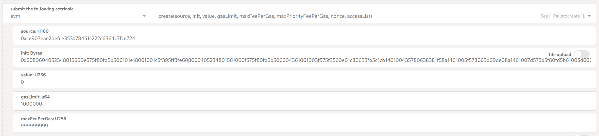
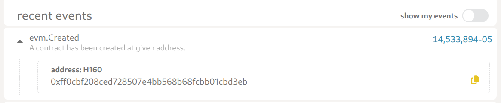
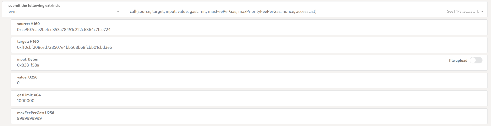

# Deploying and Interacting with EVM Smart Contracts

## Table of Contents

- [Overview](#overview)
- [Prerequisites](#prerequisites)
- [Chain Endpoints](#chain-endpoints)
  - [Testnet](#testnet)
  - [Mainnet](#mainnet)
- [Using Standard EVM Tooling](#using-standard-evm-tooling)
- [Using Polkadot JS Interface](#using-polkadot-js-interface)
  - [Deploying a Contract](#deploying-a-contract)
  - [Interacting with Contracts (evm.call)](#interacting-with-contracts-evmcall)
- [Address Formats](#address-formats)
- [Troubleshooting](#troubleshooting)

## Overview

Liberland blockchain implements EVM compatibility through [Frontier](https://github.com/polkadot-evm/frontier), enabling deployment and interaction with Ethereum smart contracts on a Substrate-based chain. Most standard EVM tooling works with Liberland blockchain out-of-the-box.

## Prerequisites

- Compiled smart contract bytecode
- Account with LLD tokens for gas fees
- Access to Polkadot JS Apps or standard Ethereum development tools

## Chain Endpoints

### Testnet

| Type     | URL                                                                                                   | Description                             | Chain ID |
| -------- | ----------------------------------------------------------------------------------------------------- | --------------------------------------- | -------- |
| RPC      | `https://testchain.liberland.org`                                                                     | HTTP endpoint                           | 12865    |
| Explorer | [Polkadot Apps](https://dotapps-io.ipns.dweb.link/?rpc=wss%3A%2F%2Ftestchain.liberland.org#/explorer) | Web interface for exploring the testnet | -        |

### Mainnet

| Type     | URL                                                                                                       | Description                                | Chain ID |
| -------- | --------------------------------------------------------------------------------------------------------- | ------------------------------------------ | -------- |
| RPC      | `https://mainnet.liberland.org`                                                                           | HTTP endpoint (operated by the Government) | 12864    |
| Explorer | [Polkadot Apps](https://dotapps-io.ipns.dweb.link/?rpc=wss%3A%2F%2Fliberland-rpc.n.dwellir.com#/explorer) | Web interface for exploring the mainnet    | -        |

## Using Standard EVM Tooling

Liberland blockchain is fully compatible with standard Ethereum tools. You can deploy and interact with contracts using:

- **MetaMask**: Add Liberland network using the RPC endpoints and Chain IDs above
- **Hardhat/Truffle**: Configure with Liberland RPC endpoint
- **Remix IDE**: Connect via MetaMask or direct RPC
- **ethers.js/web3.js**: Use standard libraries with Liberland provider

## Using Polkadot JS Interface

For users who prefer Substrate-native tooling, contracts can also be deployed and managed through the Polkadot JS Apps interface.

### Deploying a Contract

**Via Polkadot JS Apps UI:**

1. Navigate to Developer > Extrinsics
2. Select `evm.create` extrinsic
3. Fill parameters:
   - **source**: EVM address assigned to your Substrate account
   - **init**: Contract bytecode (0x-prefixed hex)
   - **value**: Amount to send (usually 0)
   - **gasLimit**: Estimated gas (e.g., 3000000)
   - **maxFeePerGas**: Gas price (e.g., 100000000)
   - **maxPriorityFeePerGas**: Priority fee (optional, can be left as None)
   - **accessList**: Leave empty unless specific access is required

4. Submit transaction
5. Navigate to Network > Explorer
6. Find contract address in `evm.Created` event

### Interacting with Contracts (evm.call)

Use `evm.call` for both read and write operations on deployed contracts.

**Via Polkadot JS Apps UI:**

1. Navigate to Developer > Extrinsics
2. Select `evm.call` extrinsic
3. Fill parameters:
   - **source**: EVM address assigned to your Substrate account
   - **target**: EVM address of the deployed contract
   - **input**: ABI-encoded function call (0x-prefixed hex)
   - **value**: Amount to send (0 for most operations)
   - **gasLimit**: Estimated gas
   - **maxFeePerGas**: Gas price (e.g., 100000000)
   - **maxPriorityFeePerGas**: Priority fee (optional)
   - **accessList**: Leave empty

4. Submit transaction

## Address Formats

Liberland blockchain uses two address formats:

- **H160 (Ethereum)**: 20-byte addresses (0x...) used for EVM operations
- **SS58 (Substrate)**: 32-byte addresses used for Substrate operations

When using Polkadot JS interface, addresses are automatically converted between formats. When using standard EVM tooling, use H160 addresses exclusively.

## Troubleshooting

### Common Issues

- **Gas estimation errors**: Increase `gasLimit` and/or `maxFeePerGas` parameters
- **Transaction reverted**: Check contract logic and input encoding
- **Address format errors**: Ensure correct format (H160 for EVM operations)
- **Insufficient balance**: Ensure account has enough LLD for gas fees on both Substrate and EVM side
