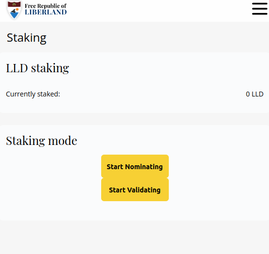
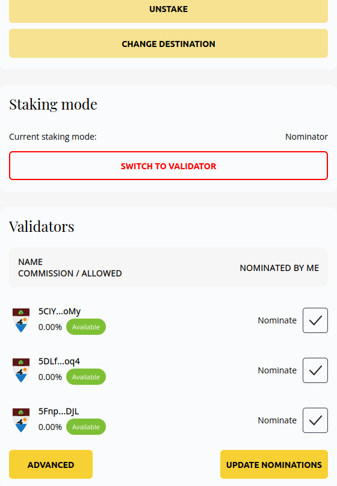

# Staking

LLD is the operational token in Liberland that can be staked to earn returns.

The maximum yearly inflation for LLD is hardcoded at 10%, which will drop in the future. 

This inflation is distributed to stakers - validators and nominators.

Validators are the actual servers running the blockchain. Only Liberland Citizens can [run validators](../for-validators-nominators-and-stakers/run-a-validator.md)

Nominators can stake their LLD and pick validators that are honest - not cheating or hacking. By doing this they help the validator get elected and in turn share the inflation and transaction rewards.

The quickest way to stake for non Liberlanders is through the [polkadotJs interface](https://polkadot.js.org/apps/?rpc=wss%3A%2F%2Fmainnet.liberland.org%2F#/staking/actions)

Liberlanders can use the dApp > Staking page to start staking:
* Click on 'Start Nominating'
* Pick the amount of LLD to stake (always leave a small amount of LLD free)
* Sign the transaction
* The screen should update, and show you the available validators
* Pick some validators
* Click on Update Nominations button
* Sign the transaction
* Done! You are now staking
  
  

## Learn more

Liberland is a fork of substrate, a Proof of Stake system that runs Polkadot. 
You can learn more about it by [clicking here](https://wiki.polkadot.network/docs/learn-staking)

The job of nominators is to select - nominate the validators that run the chain. If they select honest validators, everyone gets a reward.
If the validators are dishonest or technically unreliable, everyone gets a punishment - a portion of the staked tokens are burned.
Since Liberland is still a new chain, the burns are very minimal and the chain is "forgiving".

Validating almost always gives more rewards but only citizens can [run validators](../for-validators-nominators-and-stakers/run-a-validator.md). 
Citizens do not have to be tech guys to run them though, there is a way for [non-technical people to run validators](../for-validators-nominators-and-stakers/run-a-validator-non-technical.md).

To payout the rewards, you can click on "payout rewards" in the staking interface. This pays out for every era, so there may be more transactions to sign.
If you dont payout every 20 days, the old payouts will be deleted. This is to ensure only active validators are running the chain.                                 
Note that anyone can trigger payouts for the nominators in a particular validator. If there are no payouts to click, it could simply mean someone else already did this.
While it can be confusing, this is so the chain can run more efficiently, reducing the number of transactions needed to keep it running.
