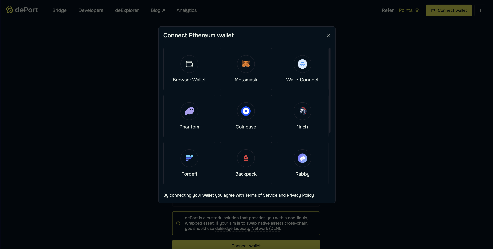
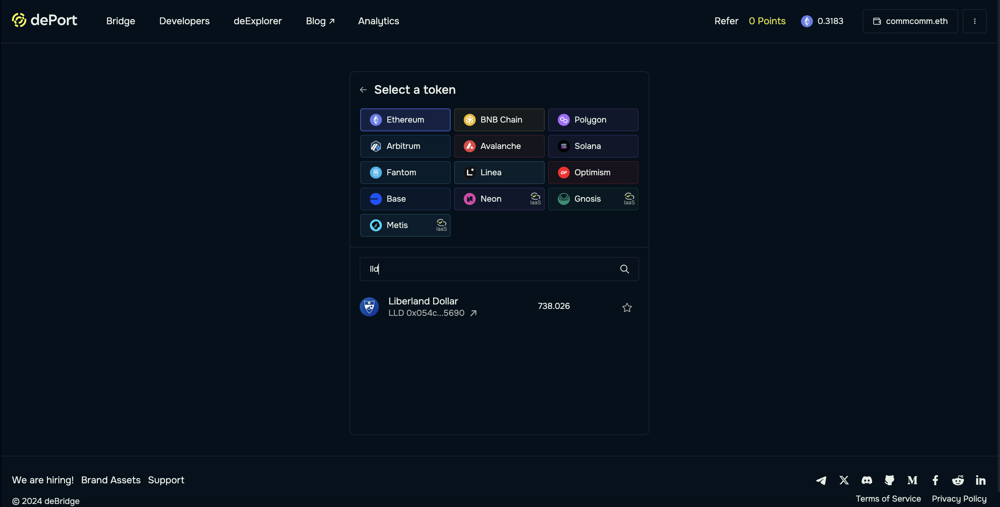
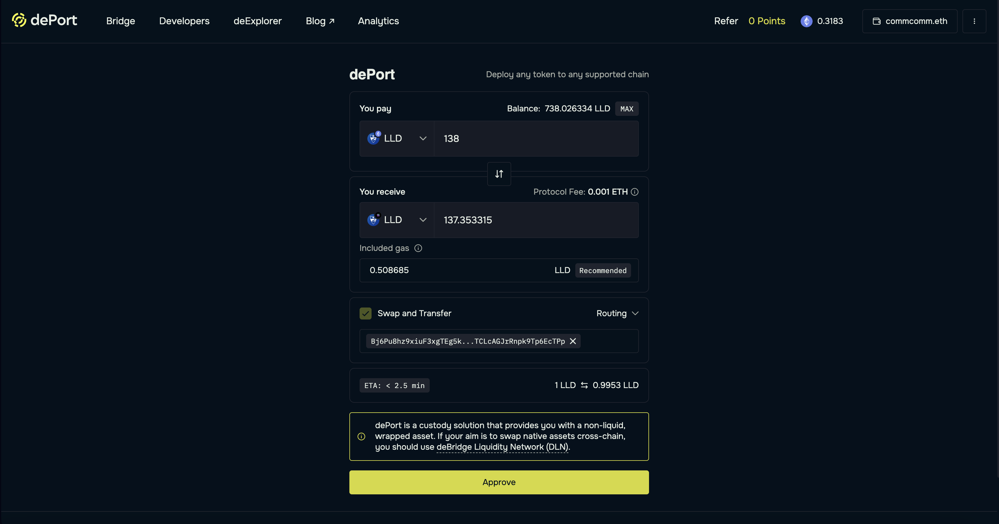
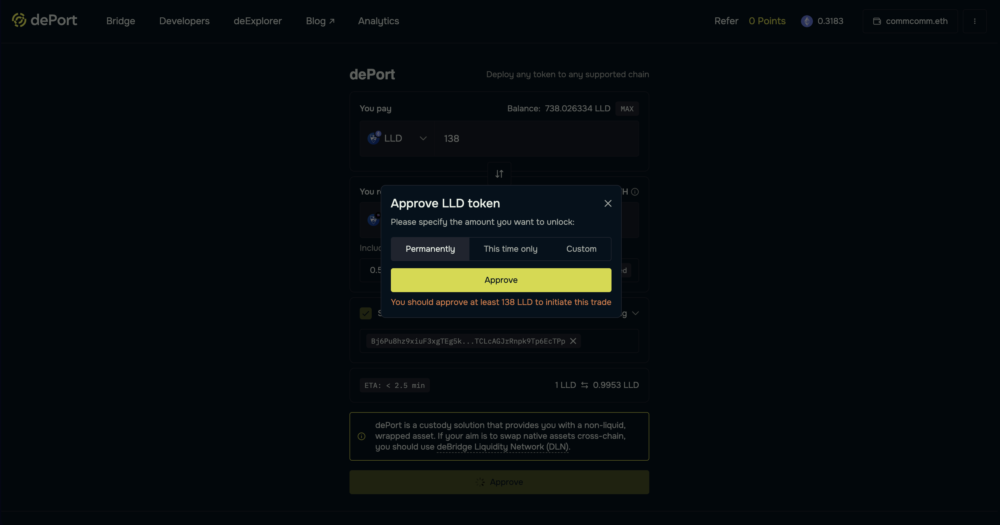
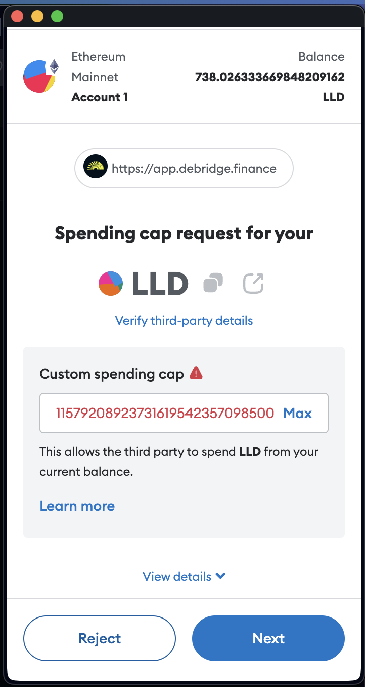
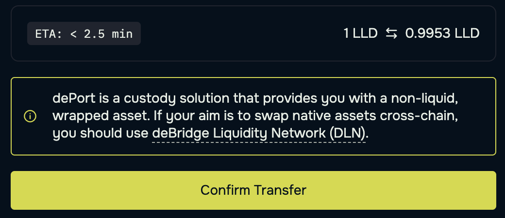
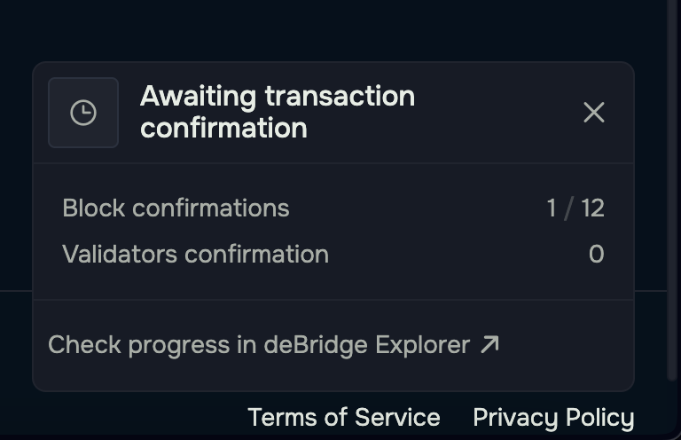
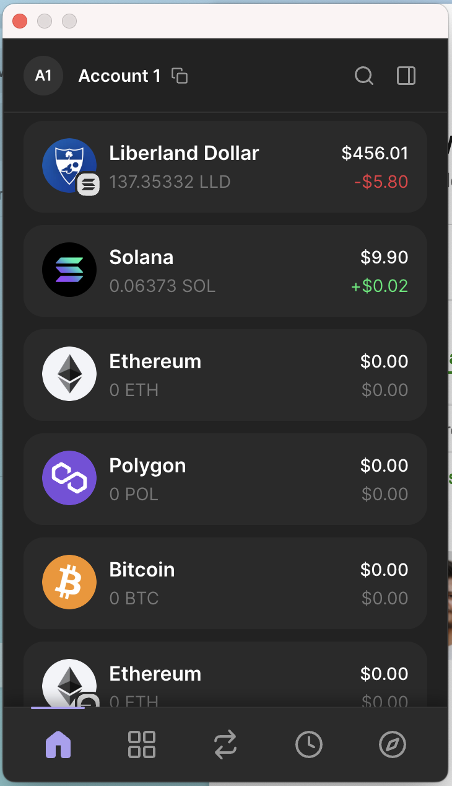

How to Bridge LLD from Ethereum to Solana

This tutorial assumes you have already bridged Liberland dollar (LLD) from Liberland Blockchain -> SORA Network -> Ethereum. You can watch a tutorial on how to perform those steps at https://www.youtube.com/watch?v=PI4hiLOK03I.

To start your Ethereum -> Solana journey, you need a few things:

- An Ethereum wallet
- ETH for transaction fees
- LLD in your Ethereum wallet
- A Solana wallet (e.g. Phantom, Solflare, Backpack, etc.)
- SOL for transaction fees

Assuming you have all of these requirements, you're ready to go! If you don't, please fulfill the requirements above before continuing. There are lots of great resources online with recommendations for Ethereum wallets, Solana wallets, exchanges where you can acquire both ETH and SOL, etc.

Once you have all of the above, visit https://app.debridge.finance/deport.

deBridge is a cross-chain interoperability and liquidity transfer protocol designed to enable seamless interactions and asset transfers between different blockchains. It facilitates the bridging of assets (tokens), smart contract calls, and messages across a variety of blockchains, addressing improved communication between decentralized applications (dApps) built on various chains.

dePort is deBridge's custody solution that provides you with non-liquid, wrapped assets. This means that LLD bridged from Ethereum to Solana are generated (minted) on Solana by dePort's smart contracts, and dePort's smart contracts have certain features and functions embedded into LLD's token contract on Solana. This is intentional by dePort, and not something that can be bypassed due to LLD's cross-chain nature.

Now that you're on dePort's app, select 'Connect Wallet'. By default, this should prompt you to connect your Ethereum wallet. Select your wallet from the list, and connect your account. 

From the 'You Pay' dropdown, type 'LLD' and you should see 'Liberland dollar' appear in the list. Select 'Liberland dollar'.

From the 'You Receive' dropdown, select the Solana blockchain.

In the 'You Pay' field, enter the amount of LLD you want to bridge from Ethereum to Solana. The 'You Receive' field should get filled automatically, and you should notice a small 'Included gas' value underneath. This small amount is a fee to deBridge for maintaining dePort.

In 'Swap and Transfer' you have two choices:

1. Paste in the Solana wallet where the LLD should be sent to after bridging
2. If you have a Solana wallet browser extension installed/enabled, select 'Connect' to connect the wallet and select the receiving wallet

Next, select 'Approve'. If this is your first time using dePort, you may see a message asking you to review the terms & conditions. Once you have read them and if you approve of them, select 'Sign and proceed'. Your Ethereum wallet will provide a message for you to sign, approving the terms & conditions on-chain.

Now you will need to approve dePort's ability to move your LLD on your behalf. This is a standard permission requested by many Web3 applications such as Uniswap, 1inch, Aave, etc. You can choose from three options:

- Approve dePort's access to all your LLD permanently; this reduces the number of steps next time you bridge
- Approve dePort's access to all your LLD this time only; this is a more secure option in case your wallet is ever compromised, but requires additional approvals next time you bridge
- Approve dePort's access to a portion of your LLD

Once you have chosen your preferred option, select 'Approve', and then confirm the approval transaction in your wallet.

Once the access approval transaction has been confirmed, you can proceed with bridging the LLD from Ethereum to Solana. Select 'Confirm Transfer', review the transaction fees to be incurred and make changes if you wish (lower transaction fees generally lead to longer wait times), and select 'Confirm Transfer' once again. Approve the transfer transaction in your wallet when prompted.

Depending on the transaction fees/priority set, you should soon see the block confirmations start to increase. dePort requires at least 12 block confirmations for the transaction to be considered successful and finalised. You can select the link at the bottom to view the transaction on deBridge Explorer.

Once the transaction has been fully confirmed, you will receive the LLD on Solana to the wallet specified! Congratulations, you have successfully bridged LLD from Ethereum to Solana.

At this stage you can move your LLD to whatever wallet you like, engage in swapping platforms like Raydium and Jupiter, or perhaps find a decentralised finance (DeFi) protocol that will allow you to use LLD in some other fashion.

If your Solana wallet doesn't automatically recognize the LLD bridged, you can often add it manually using the token contract address: `GwKKPsJdY5oWMJ8RReWLcvb82KzW6FKy2bKoYW7kHr16`

You can see LLD, the supply, holders, and other transactions on Solana here: https://solscan.io/token/GwKKPsJdY5oWMJ8RReWLcvb82KzW6FKy2bKoYW7kHr16

You can swap LLD on [Raydium](https://raydium.io/swap/?inputMint=sol&outputMint=GwKKPsJdY5oWMJ8RReWLcvb82KzW6FKy2bKoYW7kHr16) or [Jupiter](https://jup.ag/swap/SOL-GwKKPsJdY5oWMJ8RReWLcvb82KzW6FKy2bKoYW7kHr16).

If you have any questions about Liberland Blockchain or Liberland dollar, join the [Discord](https://discord.gg/z6vsBd3eUD) or [Telegram](https://t.me/liberlanders) communities for support. If you are having trouble using one of the applications involved in this process (e.g. dePort or a wallet application), we will do our best to support you but may direct you to the teams behind those products depending on the issue.