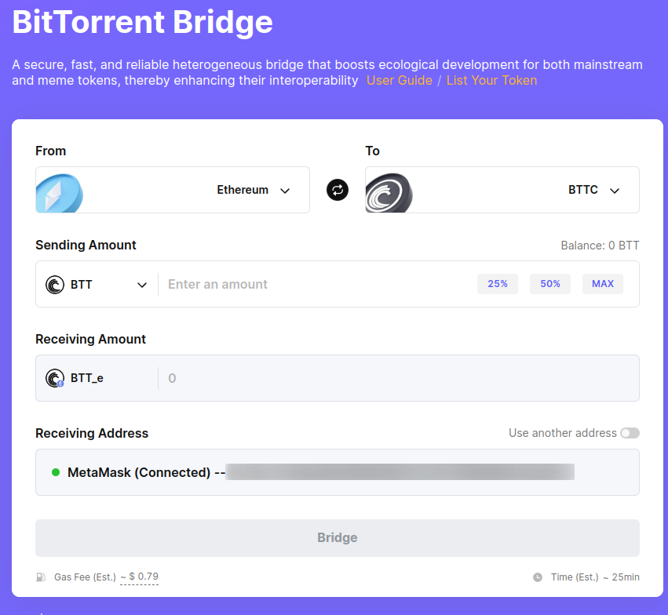
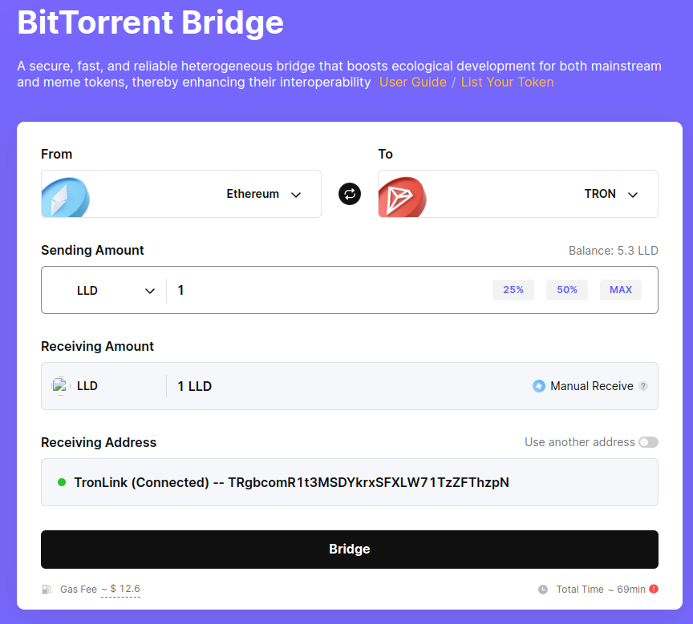

# Bridge LLD from Ethereum to TRON

This tutorial assumes you have already bridged Liberland dollar (LLD) from Liberland [Blockchain -> SORA Network -> Ethereum](./cross-chain-bridge.md). 

You can watch a tutorial on how to perform those steps at Liberland's [YouTube channel](https://www.youtube.com/watch?v=PI4hiLOK03I).

To bridge Ethereum -> TRON via BTTC, you need:

- An Ethereum wallet with $LLDs and $ETH, like MetaMask
- BTTC wallet with $BTT like metamask
  - You can get $BTT on ETHereum and bridge it to BTTC later. US$10 worth of BTT should be sufficient for gas fees and can be bought directly within the MetaMask wallet 
- TRON wallet (e.g. [TRONLink](https://www.tronlink.org/)) with $TRX tokens for fees

Once you have all of the above, visit [BitTorrent Bridge](https://app.bt.io/bridge) and select Ethereum -> BTTC and select BTT token

Now send your BTT from ETH to BTTC, so that you can pay gas fees for bridging. In our testing, BitTorrent Bridge only works with MetaMask for Ethereum connections.

Just visit [BitTorrent bridge](https://app.bt.io/bridge), select From **Ethereum** To **BTTC**, select BTT, and send a few USD worth of BTT.

The bridge takes some time and will prompt you to sign a few transactions in your wallet. Just follow the instructions from the bridge.

Next, you can bridge LLDs from ETH to TRON. You will need to connect both EVM wallet like Metamask and TRON wallet like TRONLink for this.
Just visit [Bittorrent bridge](https://app.bt.io/bridge), select From Ethereum To TRON, sending LLD.

The bridge takes some time and will prompt you to sign a  few transactions in your wallet. Just follow the instructions from the bridge.

Here is a comprehensive video tutorial showing you how to bridge LLD from Ethereum to TRON once you have BTT in your BTTC wallet, and TRX in your TRON wallet.

The process for bridging TRON to ETH is the same, just in reverse order.
