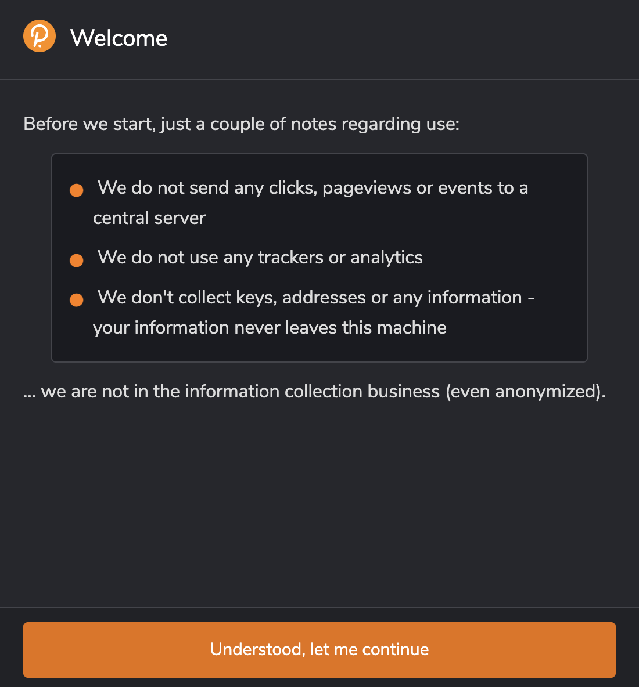
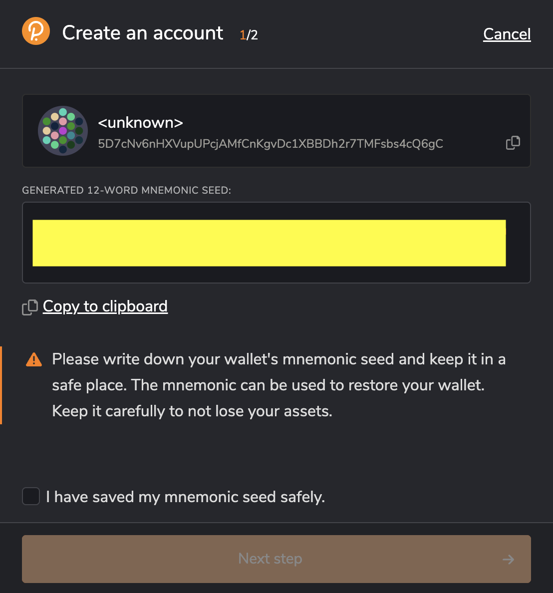
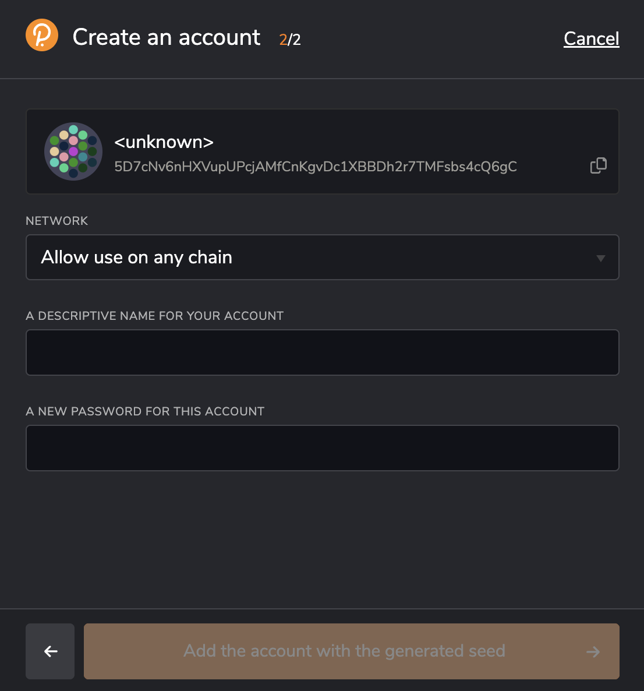
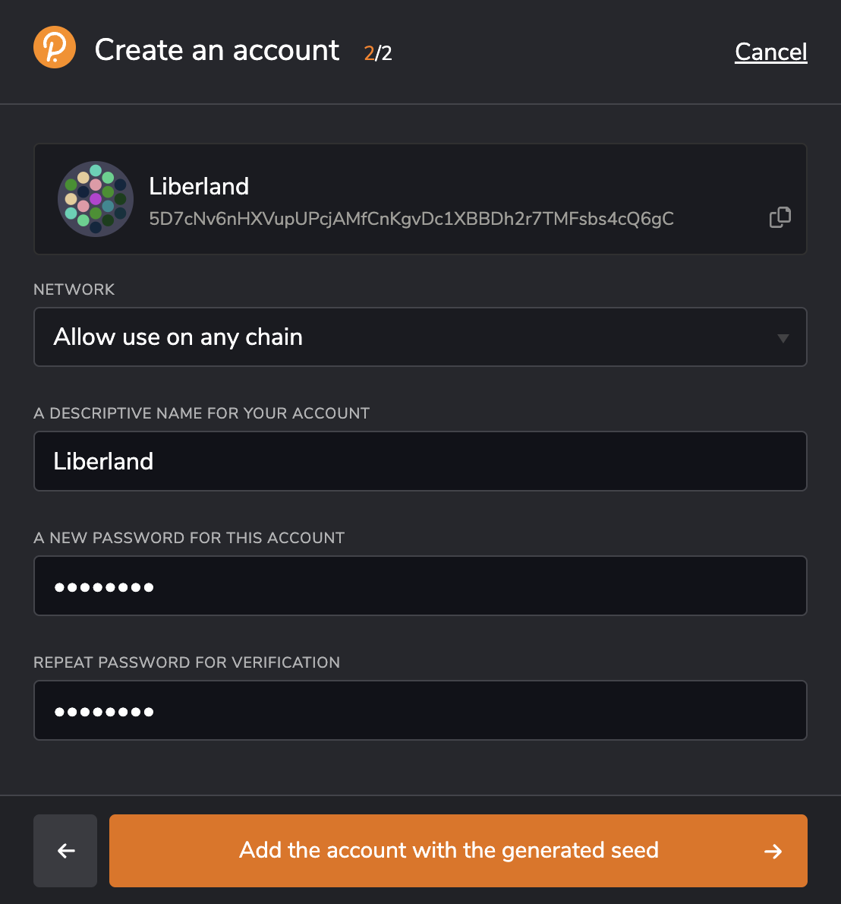
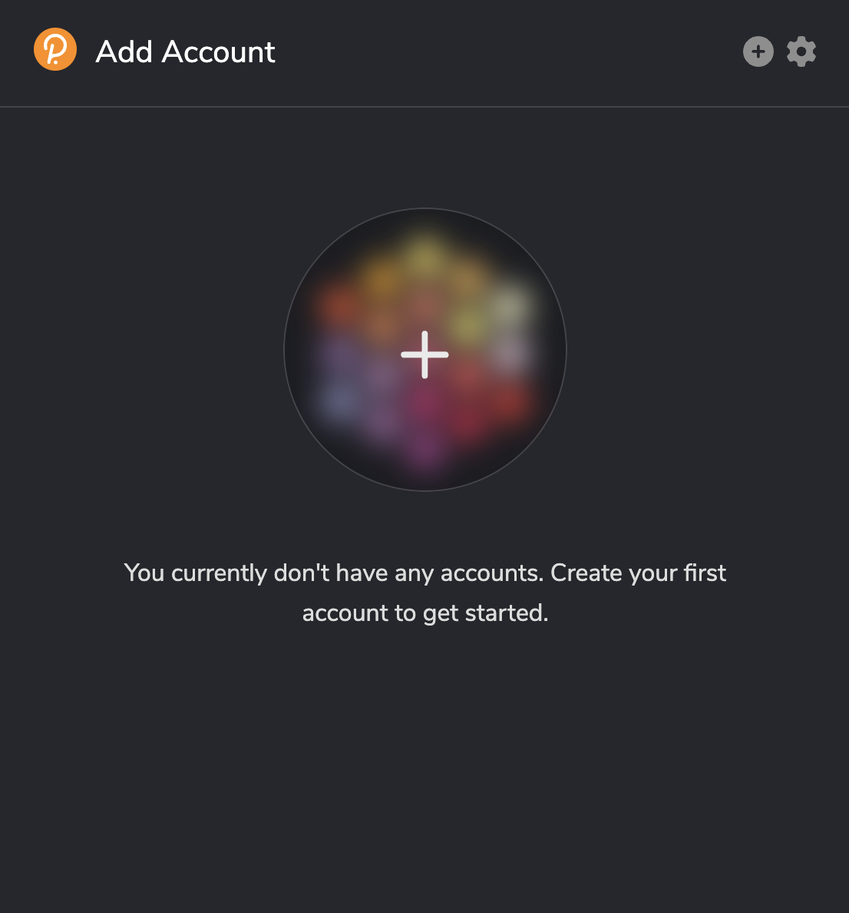
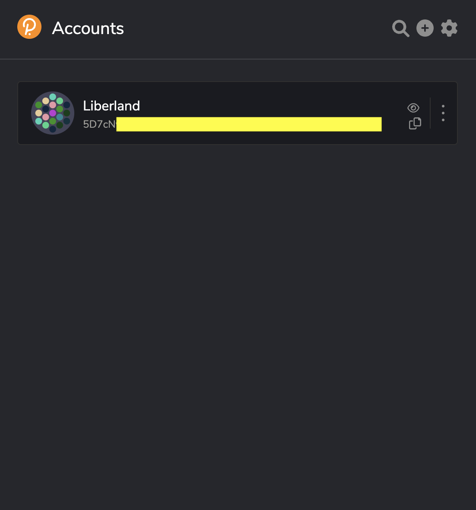

# How to Create a Liberland Blockchain Wallet Using the Polkadot.js Browser Extension

## Introduction

The Liberland blockchain uses a nominated proof-of-stake (NPoS) consensus mechanism, which makes it environmentally friendly to operate. Anyone can participate as a Nominator, while only citizens can run Validators, providing an additional layer of security against bad actors. As a nation-state whose entire governance and legislation is managed on-chain, Liberland offers non-citizens the ability to help secure the blockchain by staking LLD through the nomination of Validators who run the infrastructure for the blockchain. Nominating a good Validator leads to learning LLD, while bad Validators and their Nominators can have their LLD stakes slashed. This leads to better blockchain security and incentivizes being a good Validator and Nominator. 

Built using Parity Substrate, the same technology that powers the Polkadot ecosystem, the Liberland Blockchain benefits from some cross-compatibility with existing frameworks and tools. [Polkadot.js](https://polkadot.js.org/extension/) is a browser extension that allows you to interact with the Liberland Blockchain and other blockchain networks directly from your browser. In this guide, we will show you how to create a wallet using Polkadot.js browser extension.

## Installing Polkadot.js Browser Extension

To use Polkadot.js browser extension, you first need to install it on your browser. The extension is available for Chrome, Firefox, Brave, Opera and Edge browsers. To install the extension, follow these steps:

1. Open your browser and go to the [Polkadot.js extension webpage](https://polkadot.js.org/extension/).
2. Click the "Download for Chrome" button if you are using Chrome/Brave/Opera/Edge, or "Download for Firefox" if you are using Firefox.
3. Follow the prompts to install the extension.
4. Once the extension is installed, a new icon will appear in your browser toolbar.

## Creating a Wallet with Polkadot.js Browser Extension

To create a wallet using Polkadot.js browser extension, follow these steps:

1. Click on the Polkadot.js browser extension icon in your browser toolbar.
2. Review the welcome notes, then select “Understood, let me continue”
3. Click on the large, circular + button.
4. Save your mnemonic seed (also known as a recovery phrase) in a safe place. 

<aside>
💡 This is important because if you lose your password, you can use your recovery phrase to regain access to your account. You can also restore the same wallet on a different computer if you replace yours.

</aside>

1. Check the box that says, “I have saved my mnemonic seed safely,” then click “Next step.”
2. Add a descriptive name for your account, e.g. “Liberland Wallet,” and a strong, unique password for your account. You will need to enter this password whenever you are initiating transactions on the blockchain.
3. Select “Add the account with the generated seed.”
4. Your new account is now created, and you can use it to send and receive cryptocurrency on the Liberland Blockchain, and other similar networks.

## Managing Your Wallet with Polkadot.js Browser Extension

Once you have created a wallet with Polkadot.js browser extension, you can manage it directly from your browser. The extension allows you to view your account balance, connect to and interact with Liberland Blockchain applications, and manage your account settings. To manage your wallet, follow these steps:

1. Click on the Polkadot.js browser extension icon in your browser toolbar.
2. From the main ‘Accounts’ view, you can view your wallet address, and copy your wallet address.
3. Clicking the + button allows you to create new accounts, derive new wallet addresses from the existing account, export accounts, and more.
4. To receive cryptocurrency, click the icon that looks like two overlaid pieces of paper to copy your wallet address, then share your wallet address with the sender.

## Conclusion

Creating a wallet using Polkadot.js browser extension is a simple process that allows you to interact with the Liberland Blockchain directly from your browser. With the extension, you can create and manage your account. By following the steps outlined in this guide, you can easily create a wallet and start using the Liberland Blockchain.