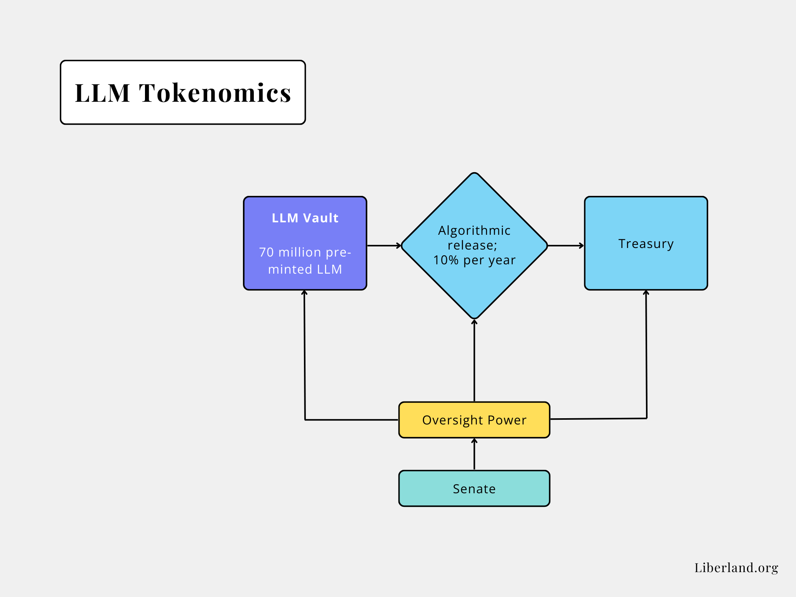
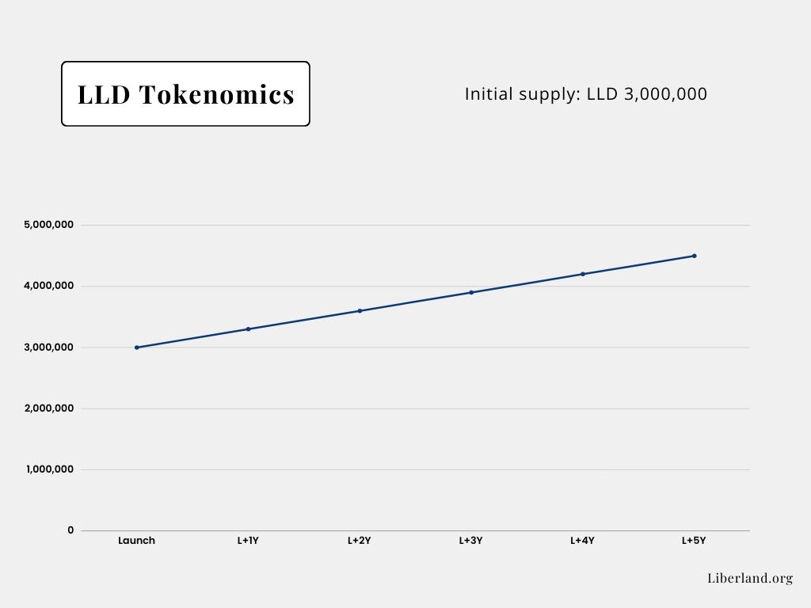

# Tokenomics Primer

## Division of Power
As all modern democratic countries, Liberland employs division of power in its government and, thereby, also on its blockchain governance mechanism. The main concentration of power on a blockchain is in the node owners and those who write new blocks - the [Validators](https://en.wikipedia.org/wiki/Proof_of_stake#Validator). 
In a [DAO](https://en.wikipedia.org/wiki/Decentralized_autonomous_organization), the power of democracy in the system would directly derive from ownership of the coin that the Validators and Nominators use.
Such a concentration of power is not desirable, as, in effect, it would ensure with mathematic certainty that those best poised to become officials in Liberland would also be those who count the votes.

To counter this, we have separated the Validator power from the governance power. So the two-token system was born: the governance token, Liberland Merit (LLM), and the coin, Liberland Dollar (LLD).

## Liberland Merit (LLM)
### Overview
Liberland Merit (LLM) is the governance token representing a share in the State and nationhood of Liberland. LLM is not a security created with the expectation of revenue; instead, it is legally close to shares in joint ownership, like in case of housing cooperatives; LLM represents one's share in the country. Governance power is connected to LLM, and there is no possibility of other governance and no separating of this power from the token.

### PolitiPooling
To prevent plutocratic concentration of power, one can only utilize LLM in politics if one vests them on a tight schedule. This vesting is called "PolitiPooling." PolitiPooled LLM is locked, and the user can only unvest 10 percent in a year: payable monthly, 1/12th of 1/10th of total vested amount, each month.

### Citizenship on the Blockchain
Liberland, as a country, acknowledges the importance of citizenship. Only Citizens with 5000 PolitiPooled (a.k.a. staked) LLM have full political rights associated with citizenship in Liberland. In this way, Liberland replaces the usual requirements proving a personal connection to the country through vesting. Where one should gain "honorary citizenship" for their contributions, they won't be able to vote in elections or referenda unless they also PolitiPool. We can expect those who commit their funds to Liberland long-term to have a provable bond with the land and a stake in the country's success. 

### Tokenomics
Inspired by Bitcoin (BTC), LLM has a fixed maximum supply of **70 000 000** tokens. With losses expected due to lost wallets and other factors, this token will, in time, become deflationary. The initial price for LLM was 1 USD, increased to 2 USD on 11 September 2023, and will change frequently when LLM begins to trade on the open market. According to Liberland's ethos and paraphrasing Adam Smith, the price of 1 LLM will be <i>"whatever the purchasers are willing to pay for it."</i>

## Liberland Dollar (LLD)
### Overview
Liberland Dollar is the native coin of Liberland Blockchain. Its primary purposes are:  
1. the coin for Validators and Nominators to stake and, thereby, secure the chain and gain rewards, which are also paid in LLD; and
2. the money to purchase goods and services (mainly off-chain), hence, the medium to record market values of primarily real-world articles.

Similarly, the price of LLD will be determined by open markets once LLD is available widely.

Please note that any references to a "preferred currency" refers solely to a government unit of accounting. There is no legal tender in Liberland. Everybody in Liberland is able to pay with whatever currency, barter, favours or other means of exchange the seller will accept, without any government interference.

### Tokenomics
#### General
The tokenomics of LLD resemble that of Polkadot (DOT). The system is based on Parity's Substrate framework, which powers the Polkadot blockchain and parachains. The main mechanisms have been created by researchers and tested by auditors and in practice. [You can read about it in detail here](https://wiki.polkadot.network/docs/maintain-polkadot-parameters). We will introduce the basic concepts in the remainder of this primer.

#### Initial Money Supply
The system plans to issue **1 300 000 LLD** at time of token generation, which is markedly less than the initial offerings of most cryptocurrencies. Likewise to LLM, the initial price was, and still is, 1 USD per 1 LLD. Despite the name, LLD is not a stablecoin but tradeable digital money, just like BTC. As such, the price will be strictly market-based.

#### Increase in Money Supply
The increase in money supply is set by the system and is constant. The initial increase is 10 percent per annum, subject to change by governance, hence, the coin holders. Coin holders are, by the virtue of their coin ownership, incentivized to keep the increase in money supply relatively low and sustainable. This increase needs to be non-zero because the higher it is, the more incentive Validators and Nominators have to keep the chain decentralized.

### Validators
[Validators](https://wiki.polkadot.network/docs/learn-staking#selection-of-Validators) get selected by the algorithm based on the size of their stake. Validators need to be LLD-holding Citizens. Their responsibility is to [produce new block candidates](https://wiki.polkadot.network/docs/learn-consensus#block-production-babe) and [finalize blocks](https://wiki.polkadot.network/docs/learn-consensus#finality-gadget-grandpa). Validators are selected per epoch and inactive Validators can be "slashed" by the system.

### Nominators
[Nominators](https://wiki.polkadot.network/docs/learn-staking#selection-of-Validators) ensure the true decentralization of the chain. Anyone can be a Nominator and becoming one is the question of having some LLD and setting up a stash. Nominators don't get reward for hosting a node, but for staking their LLD into a node of an existing Validator, hereby increasing their chance at nomination.

## Listing
The plan is to list our coins first on a cecentralized exchange (CEX) of good repute early in Q4 of 2023, along with decentralized exchanges that will make it easier for Citizens, e-Residents and other supporters to easily obtain LLD and LLM. The team appears to gravitate towards bridging to the ETH ecosystem at the moment, but is not beyond considering other options. Decentralized exchanges of good repute are, in the opinion of the team, closer related with Satoshi's vision of peer-to-peer electronic cash than centralized exchanges.

This is nonetheless a matter of convenience and adapting to existing structures. Where truly peer-to-peer solutions should be made available, e.g. not relying on smart contracts on other blockchains, those will be taken.

Listing on centralized exchanges will only be considered when the team gains the trust in the alignment of the given institution to the principles on which Liberland stands, which also includes honest business practices and solvency. 
